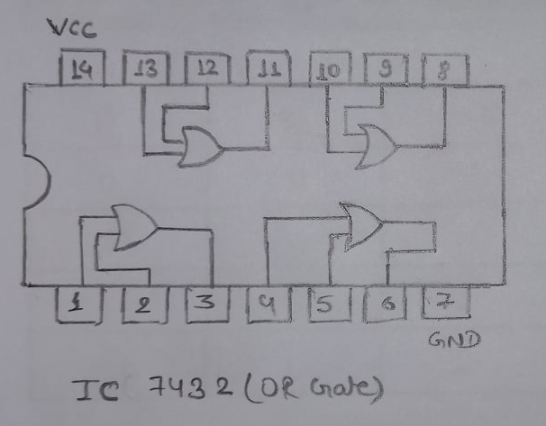
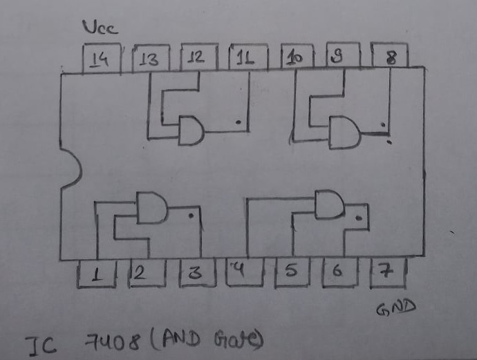
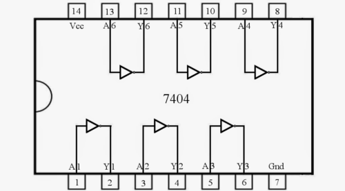

# Lab 1

## OBJECTIVE

TO VERIFY THE TRUTH TABLE OF BASIC GATES

## APPARATUS REQUIRED

1. Connecting wires
2. Breadboard kit
3. IC 7432(OR Gate)
4. IC 7408(AND Gate)
5. IC 7404(NOT Gate)

## PIN DIAGRAM

## TRUTH TABLE OF OR GATE

| A   | B   | A+B |
| --- | --- | --- |
| 0   | 0   | 0   |
| 0   | 1   | 1   |
| 1   | 0   | 1   |
| 1   | 1   | 1   |

## TRUTH TABLE OF AND GATE

| A   | B   | A.B |
| --- | --- | --- |
| 0   | 0   | 0   |
| 0   | 1   | 0   |
| 1   | 0   | 0   |
| 1   | 1   | 1   |

## TRUTH TABLE OF NOT GATE

| A   | NOT A |
| --- | ----- |
| 0   | 1     |
| 1   | 0     |

## RESULT

The truth table of Basic gates is verified.
