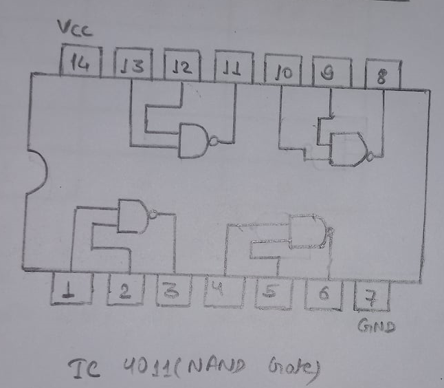
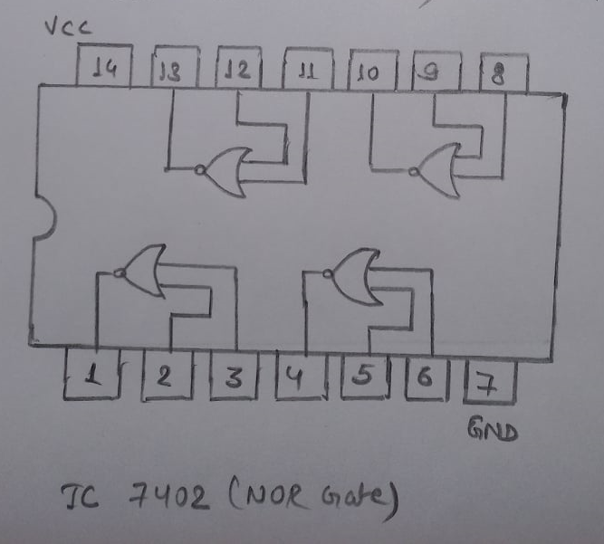

# Lab 2

## OBJECTIVE

TO VERIFY TRUTH TABLE OF NAND AND NOR GATES

## APPARATUS REQUIRED

1. Connecting wires
2. Breadboard kit
3. IC 4011(NAND Gate)
4. IC 7402(NOR Gate)

## PIN DIAGRAM OF UNIVERSAL GATES

## TRUTH TABLE OF NAND GATE

| A   | B   | A(NAND)B |
| --- | --- | -------- |
| 0   | 0   | 1        |
| 0   | 1   | 1        |
| 1   | 0   | 1        |
| 1   | 1   | 0        |

## TRUTH TABLE OF NOR GATE

| A   | B   | A(NOR)B |
| --- | --- | ------- |
| 0   | 0   | 1       |
| 0   | 1   | 0       |
| 1   | 0   | 0       |
| 1   | 1   | 0       |

## RESULT

The truth table of UNIVERSAL gates is verified successfully.
