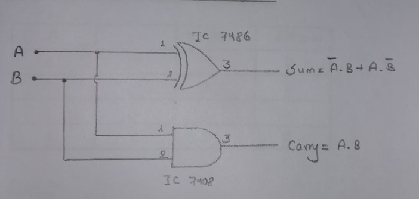
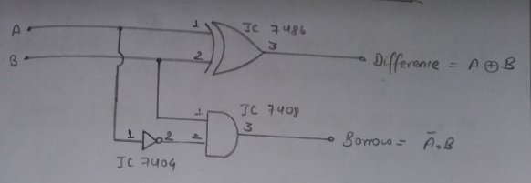

# Lab 3

## OBJECTIVE

TO VERIFY TRUTH TABLE OF HALF ADDER AND HALF SUBTRACTOR

## APPARATUS REQUIRED

1. Connecting wires
2. Breadboard kit
3. IC 7408(AND Gate)
4. IC 7486(XOR Gate)

## CIRCUIT DIAGRAM OF HALF ADDER

## TRUTH TABLE OF HALF ADDER

| Inputs             |                    | Outputs              |                        |
| ------------------ | ------------------ | -------------------- | ---------------------- |
| <strong>A</strong> | <strong>B</strong> | <strong>Sum</strong> | <strong>Carry</strong> |
| 0                  | 0                  | 0                    | 0                      |
| 0                  | 1                  | 1                    | 0                      |
| 1                  | 0                  | 1                    | 0                      |
| 1                  | 1                  | 0                    | 1                      |

## CIRCUIT DIAGRAM OF HALF SUBTRACTOR

## TRUTH TABLE OF HALF SUBTRACTOR

| Inputs             |                    | Outputs                     |                         |
| ------------------ | ------------------ | --------------------------- | ----------------------- |
| <strong>A</strong> | <strong>B</strong> | <strong>Difference</strong> | <strong>Borrow</strong> |
| 0                  | 0                  | 0                           | 0                       |
| 0                  | 1                  | 1                           | 1                       |
| 1                  | 0                  | 1                           | 0                       |
| 1                  | 1                  | 0                           | 0                       |

## RESULT

The truth table of Half Adder and Half Subtractor is verified successfully.
