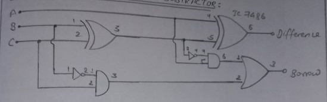

# Lab 4

## OBJECTIVE

TO VERIFY THE TRUTH TABLE OF FULL ADDER AND SUBTRACTOR

## APPARATUS REQUIRED

1. Connecting wires
2. Breadboard kit
3. IC 7408(AND Gate)
4. IC 7486(XOR Gate)
5. IC 7432(OR Gate)

## CIRCUIT DIAGRAM OF FULL ADDER

## TRUTH TABLE OF FULL ADDER

| Inputs |     |     | Outputs |       |
| ------ | --- | --- | ------- | ----- |
| A      | B   | Cin | Sum     | Carry |
| 0      | 0   | 0   | 0       | 0     |
| 0      | 0   | 1   | 1       | 0     |
| 0      | 1   | 0   | 1       | 0     |
| 0      | 1   | 1   | 0       | 1     |
| 1      | 0   | 0   | 1       | 0     |
| 1      | 0   | 1   | 0       | 1     |
| 1      | 1   | 0   | 0       | 1     |
| 1      | 1   | 1   | 1       | 1     |

## CIRCUIT DIAGRAM OF FULL SUBTRACTOR

## TRUTH TABLE OF FULL SUBTRACTOR

| Inputs |     |     | Outputs    |        |
| ------ | --- | --- | ---------- | ------ |
| A      | B   | Bin | Difference | Borrow |
| 0      | 0   | 0   | 0          | 0      |
| 0      | 0   | 1   | 1          | 1      |
| 0      | 1   | 0   | 1          | 1      |
| 0      | 1   | 1   | 0          | 1      |
| 1      | 0   | 0   | 1          | 0      |
| 1      | 0   | 1   | 0          | 0      |
| 1      | 1   | 0   | 0          | 0      |
| 1      | 1   | 1   | 1          | 1      |

## RESULT

The truth table of Full Adder and Full Subtractor are verified successfully.
