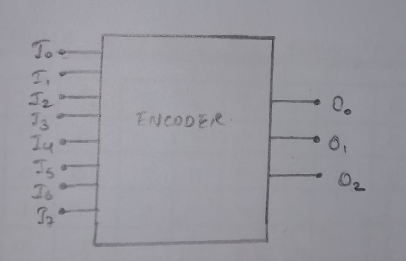
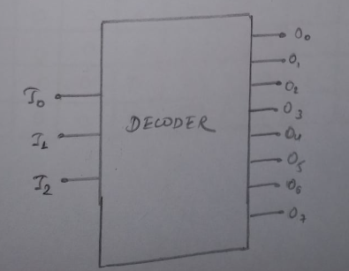
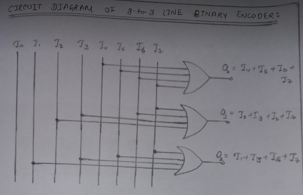
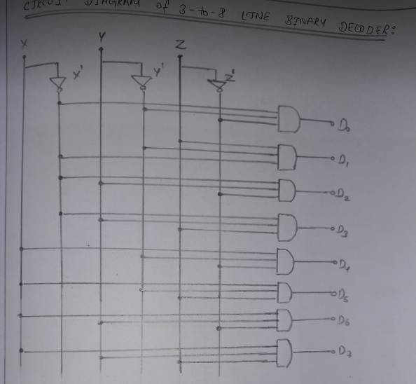
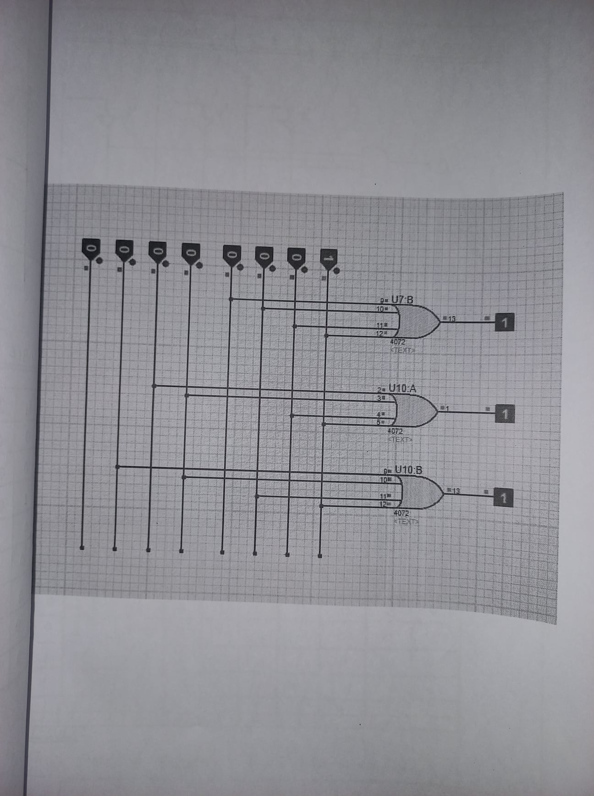

# Lab 5

## OBJECTIVE

TO VERIFY TRUTH TABLE OF ENCODER AND DECODER VIA SIMULATOR

## APPARATUS REQUIRED

Simulator

## BLOCK DIAGRAM OF 8-TO-3 LINE BINARY ENCODER AND 3-T0-6 LINE DECODER

## CIRCUIT DIAGRAM OF 8-TO-3 LINE BINARY ENCODER

## TRUTH TABLE OF 8-TO-3 LINE BINARY ENCODER

| I0  | I1  | I2  | I3  | I4  | I5  | I6  | I7  | O0  | O1  | O2  |
| --- | --- | --- | --- | --- | --- | --- | --- | --- | --- | --- |
| 1   | 0   | 0   | 0   | 0   | 0   | 0   | 0   | 0   | 0   | 0   |
| 0   | 1   | 0   | 0   | 0   | 0   | 0   | 0   | 0   | 0   | 1   |
| 0   | 0   | 1   | 0   | 0   | 0   | 0   | 0   | 0   | 1   | 0   |
| 0   | 0   | 0   | 1   | 0   | 0   | 0   | 0   | 0   | 1   | 1   |
| 0   | 0   | 0   | 0   | 1   | 0   | 0   | 0   | 1   | 0   | 0   |
| 0   | 0   | 0   | 0   | 0   | 1   | 0   | 0   | 1   | 0   | 1   |
| 0   | 0   | 0   | 0   | 0   | 0   | 1   | 0   | 1   | 1   | 0   |
| 0   | 0   | 0   | 0   | 0   | 0   | 0   | 1   | 1   | 1   | 1   |

## CIRCUIT DIAGRAM OF 3-TO-8 LINE BINARY DECODER

## TRUTH TABLE OF 3-TO-8 LINE BINARY DECODER

| Inputs |     |     | Outputs |     |     |     |     |     |     |     |
| ------ | --- | --- | ------- | --- | --- | --- | --- | --- | --- | --- |
| X      | Y   | Z   | D0      | D1  | D2  | D3  | D4  | D5  | D6  | D7  |
| 0      | 0   | 0   | 1       | 0   | 0   | 0   | 0   | 0   | 0   | 0   |
| 0      | 0   | 1   | 0       | 1   | 0   | 0   | 0   | 0   | 0   | 0   |
| 0      | 1   | 0   | 0       | 0   | 1   | 0   | 0   | 0   | 0   | 0   |
| 0      | 1   | 1   | 0       | 0   | 0   | 1   | 0   | 0   | 0   | 0   |
| 1      | 0   | 0   | 0       | 0   | 0   | 0   | 1   | 0   | 0   | 0   |
| 1      | 0   | 1   | 0       | 0   | 0   | 0   | 0   | 1   | 0   | 0   |
| 1      | 1   | 0   | 0       | 0   | 0   | 0   | 0   | 0   | 1   | 0   |
| 1      | 1   | 1   | 0       | 0   | 0   | 0   | 0   | 0   | 0   | 1   |

## Simulator Image for Encoder

## Simulator Image for Decoder

## RESULT

The truth table of Encoder and Decoder is verified successfully.
