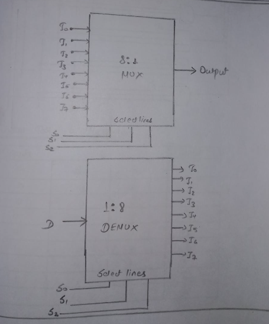
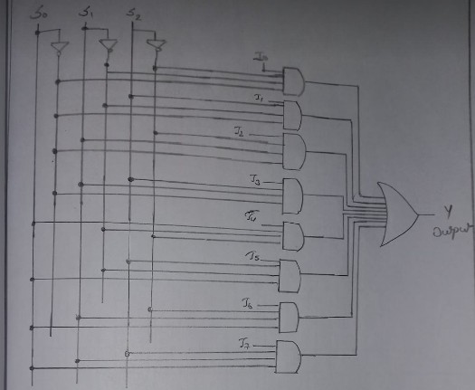
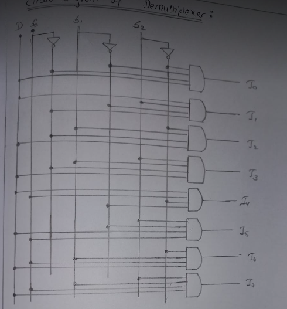
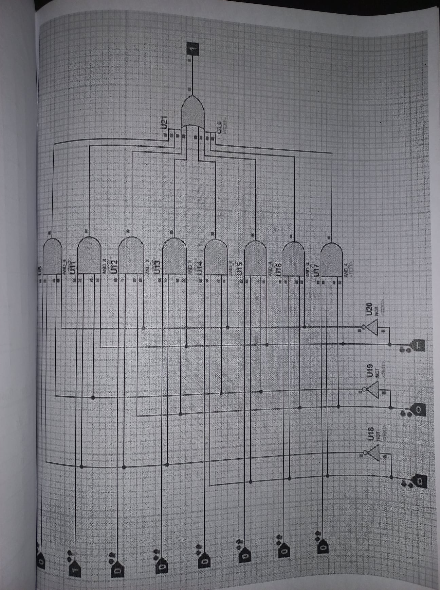
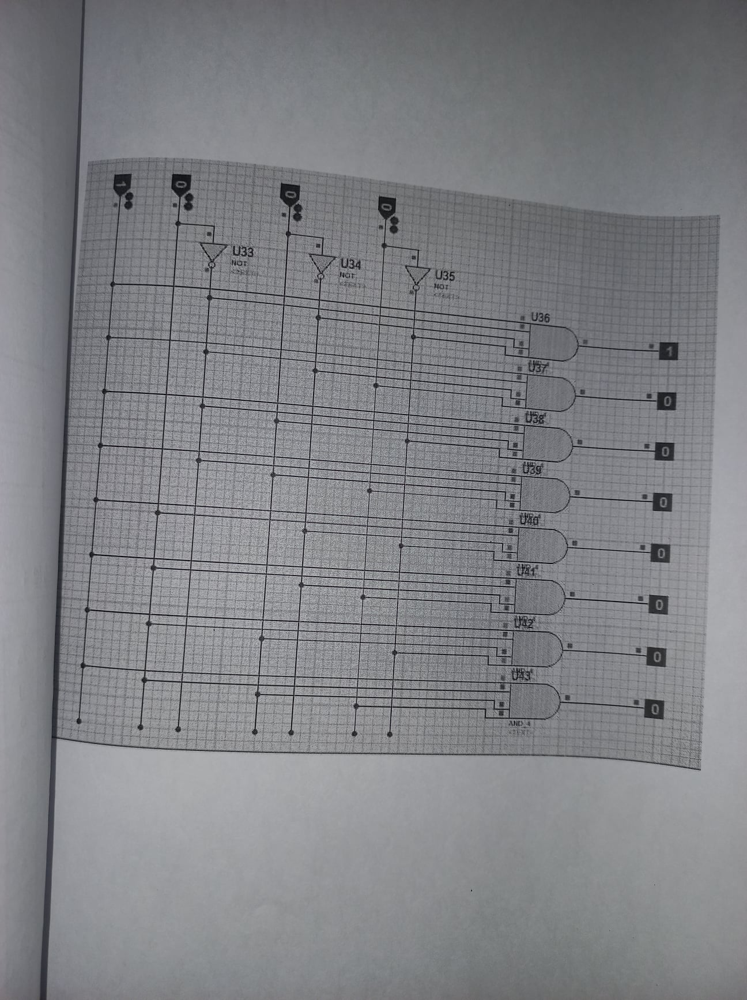

# Lab 6

## OBJECTIVE

TO VERIFY TRUTH TABLE OF MULTIPLEXER(1:8) AND DEMULTIPLEXER(8:1) via SIMULATOR

## APPARATUS REQUIRED

Simulator

## BLOCK DIAGRAM OF 1:8 MULTIPLEXER AND DEMULTIPLEXER

# Circuit Diagram of Multiplexer

## Function Table of Multiplexer

<table>
    <thead>
        <tr>
            <th colspan="3">Inputs</th>
            <th>Output</th>
        </tr>
        <tr>
            <th>S0</th>
            <th>S1</th>
            <th>S2</th>
            <th>Y</th>
        </tr>
    </thead>
    <tbody>
        <tr>
            <td>0</td>
            <td>0</td>
            <td>0</td>
            <td>I0</td>
        </tr>
        <tr>
            <td>0</td>
            <td>0</td>
            <td>1</td>
            <td>I1</td>
        </tr>
        <tr>
            <td>0</td>
            <td>1</td>
            <td>0</td>
            <td>I2</td>
        </tr>
        <tr>
            <td>0</td>
            <td>1</td>
            <td>1</td>
            <td>I3</td>
        </tr>
        <tr>
            <td>1</td>
            <td>0</td>
            <td>0</td>
            <td>I4</td>
        </tr>
        <tr>
            <td>1</td>
            <td>0</td>
            <td>1</td>
            <td>I5</td>
        </tr>
        <tr>
            <td>1</td>
            <td>1</td>
            <td>0</td>
            <td>I6</td>
        </tr>
        <tr>
            <td>1</td>
            <td>1</td>
            <td>1</td>
            <td>I7</td>
        </tr>
    </tbody>
</table>

## Circuit Diagram of Demultiplexer

## Function Table of Demultiplexer

<table>
    <thead>
        <tr>
            <th rowspan="2">D</th>
            <th colspan="3">Select</th>
            <th colspan="8">Outputs</th>
        </tr>
        <tr>
            <th>S0</th>
            <th>S1</th>
            <th>S2</th>
            <th>I0</th>
            <th>I1</th>
            <th>I2</th>
            <th>I3</th>
            <th>I4</th>
            <th>I5</th>
            <th>I6</th>
            <th>I7</th>
        </tr>
    </thead>
    <tbody>
        <tr>
            <td>1</td>
            <td>0</td>
            <td>0</td>
            <td>0</td>
            <td>1</td>
            <td>0</td>
            <td>0</td>
            <td>0</td>
            <td>0</td>
            <td>0</td>
            <td>0</td>
            <td>0</td>
        </tr>
        <tr>
            <td>1</td>
            <td>0</td>
            <td>0</td>
            <td>1</td>
            <td>0</td>
            <td>1</td>
            <td>0</td>
            <td>0</td>
            <td>0</td>
            <td>0</td>
            <td>0</td>
            <td>0</td>
        </tr>
        <tr>
            <td>1</td>
            <td>0</td>
            <td>1</td>
            <td>0</td>
            <td>0</td>
            <td>0</td>
            <td>1</td>
            <td>0</td>
            <td>0</td>
            <td>0</td>
            <td>0</td>
            <td>0</td>
        </tr>
        <tr>
            <td>1</td>
            <td>0</td>
            <td>1</td>
            <td>1</td>
            <td>0</td>
            <td>0</td>
            <td>0</td>
            <td>1</td>
            <td>0</td>
            <td>0</td>
            <td>0</td>
            <td>0</td>
        </tr>
        <tr>
            <td>1</td>
            <td>1</td>
            <td>0</td>
            <td>0</td>
            <td>0</td>
            <td>0</td>
            <td>0</td>
            <td>0</td>
            <td>1</td>
            <td>0</td>
            <td>0</td>
            <td>0</td>
        </tr>
        <tr>
            <td>1</td>
            <td>1</td>
            <td>0</td>
            <td>1</td>
            <td>0</td>
            <td>0</td>
            <td>0</td>
            <td>0</td>
            <td>0</td>
            <td>1</td>
            <td>0</td>
            <td>0</td>
        </tr>
        <tr>
            <td>1</td>
            <td>1</td>
            <td>1</td>
            <td>0</td>
            <td>0</td>
            <td>0</td>
            <td>0</td>
            <td>0</td>
            <td>0</td>
            <td>0</td>
            <td>1</td>
            <td>0</td>
        </tr>
        <tr>
            <td>1</td>
            <td>1</td>
            <td>1</td>
            <td>1</td>
            <td>0</td>
            <td>0</td>
            <td>0</td>
            <td>0</td>
            <td>0</td>
            <td>0</td>
            <td>0</td>
            <td>1</td>
        </tr>
    </tbody>
</table>

## Simulator diagram of Multiplexer

## Simulator diagram of DeMultiplexer

## RESULT

The truth table of Multiplexer and Demultiplexer is verified.
