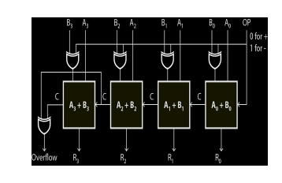
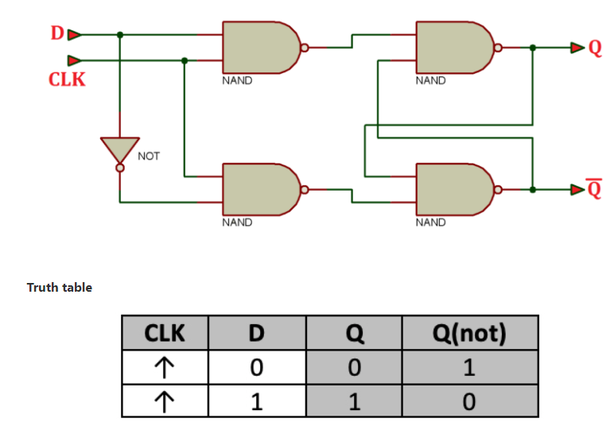
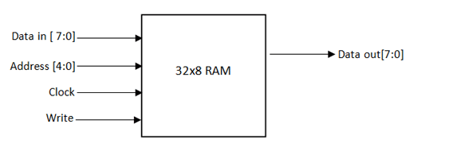
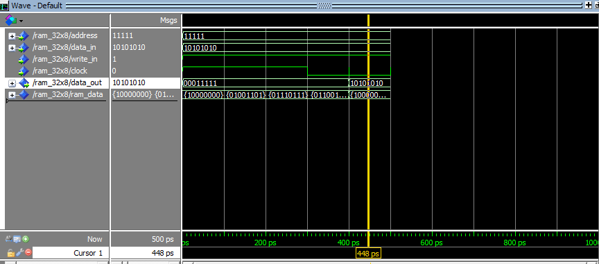

# Computer Architecture

## Programs

- ### Using C++

  - [1s and 2s complement](1s_and_2s_complement.cpp)
  - [Booth's algorithm](Booths_algo.cpp)
  - [Multiplication using Signed Magnitude](multiplication_using_signed_magnitude.cpp)
  - [Non-restoring division](Non-restoring_division.cpp)

- ### Using VHDL(_very high-speed integrated circuit hardware description language_)

  - [AND gate](VHDL_labs/AND.vhd)
  - [OR gate](VHDL_labs/OR.vhd)
  - [NOT gate](VHDL_labs/NOT.vhd)
  - [Half Adder](VHDL_labs/Half_Adder.vhd)
  - [Full Adder](VHDL_labs/Full_Adder.vhd)
  - [Design of ALU](VHDL_labs/Design_of_ALU.vhd)
  - [Multiplexer: 4 to 1](VHDL_labs/MUX_4_to_1.vhd)
  - [Demultiplexer: 1 to 4](VHDL_labs/DEMUX_1_to_4.vhd)
  - [Encoder 8 to 3](VHDL_labs/Encoder_8_to_3.vhd)
  - [Decoder 2 to 4](VHDL_labs/Decoder_2_to_4.vhd)
  - [Parity Generator](VHDL_labs/Parity_Generator.vhd)
  - [Parity Checker](VHDL_labs/Parity_Checker.vhd)
  - [4-bit adder-subtractor](VHDL_labs/4_bit_adder_subtractor.vhd)

    
  - [Signed Numbers](VHDL_labs/Signed_numbers.vhd)
  - [Parallel IN Parallel OUT](VHDL_labs/Parallel_IN_Parallel_OUT.vhd)
  - [Shifter Design in VHDL](VHDL_labs/Shifter_Design_in_VHDL.vhd)
    
  - [Comparator](VHDL_labs/Comparator.vhd)
  - [ROM 32x8](VHDL_labs/ROM_32x8.vhd)
  - [Binary to Gray Code Converter](VHDL_labs/Binary_to_Gray_Code.vhd)
  - [Gray Code to Binary](VHDL_labs/Gray_code_to_Binary.vhd)
  - [Binary to Excess 3 code](VHDL_labs/Binary_to_XS_3_code.vhd)
  - [D-flip flop](VHDL_labs/D_flip_flop.vhd)

    
  - [Program to implement Multiplier using VHDL](VHDL_labs/Multiplier_using_VHDL.vhd)
  - [32 x 8 RAM](VHDL_labs/32x8_RAM.vhd)

    
    
    Output:

    
  - [Implementation of ROM](VHDL_labs/ROM.vhd)

    

## References

VHDL - [VHDL Tutorial](https://www.tutorialspoint.com/vlsi_design/vlsi_design_vhdl_introduction.htm#:~:text=VHDL%20stands%20for%20very%20high,DoD)
