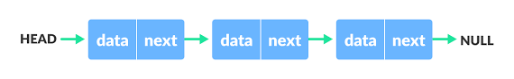
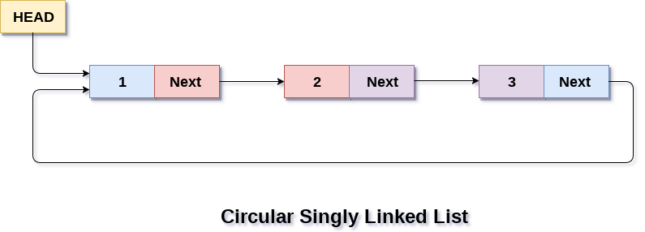

# Linked List

```README
  A linked list is a linear collection of data elements whose order is not given by their physical placement in memory. Instead, each element points to the next. It is a data structure consisting of a collection of nodes which together represent a sequence.
```

- A node is created as:

```c++
  struct node {
    int x;
    node *next;
  };
```



## Programs:

- [Singular Linked List](https://github.com/sthsuyash/CSIT_Labs/blob/main/3rd_Semester/DSA/Lab5/singlyLinkedList.cpp)
- [Circular Linked List](https://github.com/sthsuyash/CSIT_Labs/blob/main/3rd_Semester/DSA/Lab5/circularLinkedList.cpp)
- [Doubly Linked List](https://github.com/sthsuyash/CSIT_Labs/blob/main/3rd_Semester/DSA/Lab5/doublyLinkedList.cpp)
- [Doubly Circular Linked List](https://github.com/sthsuyash/CSIT_Labs/blob/main/3rd_Semester/DSA/Lab5/doublyCircularLinkedList.cpp)
- Implementation of Stack and Queue using Linked List
  - [Stack implementation using Linked List](https://github.com/sthsuyash/CSIT_Labs/blob/main/3rd_Semester/DSA/Lab5/stackUsingLinkedList.cpp)
  - [Queue implementation using Linked List](https://github.com/sthsuyash/CSIT_Labs/blob/main/3rd_Semester/DSA/Lab5/queueUsingLinkedList.cpp)

## Singly Linked List

Linked List can be defined as collection of objects called nodes that are randomly stored in the memory.

A node contains two fields i.e.

- data stored at that particular address and the pointer which contains the address of the next node in the memory.
- The last node of the list contains pointer to the null.


## Doubly Linked List

A doubly linked list is a linked data structure that consists of a set of sequentially linked records called nodes. Each node contains two fields, called links, that are references to the previous and to the next node in the sequence of nodes.


## Circular Singly Linked List

In a circular Singly linked list, the last node of the list contains a pointer to the first node of the list. We can have circular singly linked list as well as circular doubly linked list.

We traverse a circular singly linked list until we reach the same node where we started. The circular singly liked list has no beginning and no ending. There is no null value present in the next part of any of the nodes.



Circular linked list are mostly used in task maintenance in operating systems. There are many examples where circular linked list are being used in computer science including browser surfing where a record of pages visited in the past by the user, is maintained in the form of circular linked lists and can be accessed again on clicking the previous button.

## Circular Doubly Linked List

A circular doubly linked list is a variation of a doubly linked list in which the first and last nodes are linked to each other. This allows traversal of the list in both directions.

Circular doubly linked list doesn't contain NULL in any of the node. The last node of the list contains the address of the first node of the list. The first node of the list also contain address of the last node in its previous pointer.


