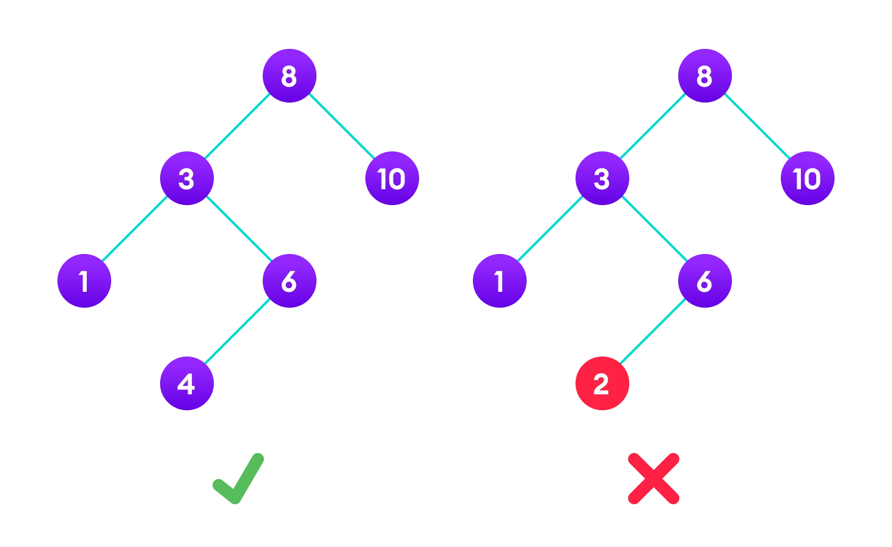

# Trees and Graphs

## Programs

- [Binary Search Tree](binary_search_tree.cpp)
- [AVL Tree](AVL_tree.cpp)
- [Kruskal's Algorithm](Kruskal_algorithm.cpp)
- [Prim's Algorithm](Prim_algorithm.cpp)
- [Dijkstra's Algorithm](Dijkstra_algorithm.cpp)
- [Binary Tree](binary_tree.cpp)
- [Breadth First Search](breadthFirstSearch.cpp)
- [Depth First Search](depthFirstSearch.cpp)
- [Huffman Coding](Huffman_Coding.cpp)

## Binary Search Tree

A binary search tree is a binary tree in which the value of each internal node is greater than or equal to all the values in the left subtree and less than or equal to all the values in the right subtree.

Binary search tree is a data structure that quickly allows us to maintain a sorted list of numbers.

- It is called a binary tree because each tree node has a maximum of two children.
- It is called a search tree because it can be used to search for the presence of a number in O(log(n)) time.

The properties that separate a binary search tree from a regular binary tree is

1. All nodes of left subtree are less than the root node
2. All nodes of right subtree are more than the root node
3. Both subtrees of each node are also BSTs i.e. they have the above two properties



The binary tree on the right isn't a binary search tree because the right subtree of the node "3" contains a value smaller than it.

There are two basic operations that you can perform on a binary search tree:

1. ### Search Operation

   The algorithm depends on the property of BST that if each left subtree has values below root and each right subtree has values above the root.

   If the value is below the root, we can say for sure that the value is not in the right subtree; we need to only search in the left subtree and if the value is above the root, we can say for sure that the value is not in the left subtree; we need to only search in the right subtree.

   - Algorithm:

   ```c
     If root == NULL
         return NULL;
     If number == root->data
         return root->data;
     If number < root->data
         return search(root->left)
     If number > root->data
         return search(root->right)
   ```

2. ### Insert Operation

   Inserting a value in the correct position is similar to searching because we try to maintain the rule that the left subtree is lesser than root and the right subtree is larger than root.

   We keep going to either right subtree or left subtree depending on the value and when we reach a point left or right subtree is null, we put the new node there.

   - Algorithm:

   ```c
     if node == NULL
       return createNode(data)
     if (data < node->data)
       node->left = insert(node->left, data);
     else if (data > node->data)
       node->right = insert(node->right, data);
     return node;
   ```

   The algorithm isn't as simple as it looks. It is a recursive algorithm and it is important to understand how it works.

3. ### Deletion Operation

   There are three cases for deleting a node from a binary search tree.

   1. **Case I**:

   In the first case, the node to be deleted is the leaf node. In such a case, simply delete the node from the tree.

   2. **Case II**:

   In the second case, the node to be deleted has a single child node. In such a case follow the steps below:

   - Replace that node with its child node.
   - Remove the child node from its original position.

   3. **Case III**:

      In the third case, the node to be deleted has two children. In such a case follow the steps below:

      - Get the inorder successor of that node.
      - Replace the node with the inorder successor.
      - Remove the inorder successor from its original position.

   ## Binary Search Tree Applications

   - In multilevel indexing in the database
   - For dynamic sorting
   - For managing virtual memory areas in Unix kernel

   ## Binary Seach Tree Complexities

   - Space Complexity: O(n)

   - Time Complexity

     | Operation | Best Case Complexity | Average Case Complexity | Worst Case Complexity |
     | --------- | -------------------- | ----------------------- | --------------------- |
     | Search    | O(log(n))            | Olog(n))                | O(n)                  |
     | Insertion | O(log(n))            | Olog(n))                | O(n)                  |
     | Deletion  | O(log(n))            | Olog(n))                | O(n)                  |

## AVL Tree

AVL tree is a self-balancing binary search tree in which each node maintains extra information called a balance factor whose value is either -1, 0 or +1.

AVL tree got its name after its inventor Georgy Adelson-Velsky and Landis.

### Balance Factor

Balance factor of a node in an AVL tree is the difference between the height of the left subtree and that of the right subtree of that node.

```README
Balance Factor = (Height of Left Subtree - Height of Right Subtree)
```

`The self balancing property of an avl tree is maintained by the balance factor. The value of balance factor should always be -1, 0 or +1.`

### Operations on an AVL tree

Various operations that can be performed on an AVL tree are:

Rotating the subtrees in an AVL Tree
In rotation operation, the positions of the nodes of a subtree are interchanged.

There are two types of rotations:

1. ### Left Rotate

   In left-rotation, the arrangement of the nodes on the right is transformed into the arrangements on the left node.

2. ### Right Rotate

   In left-rotation, the arrangement of the nodes on the left is transformed into the arrangements on the right node.

### AVL Tree Applications

For indexing large records in databases
For searching in large databases

## Kruskal's Algorithm

Kruskal's algorithm is a minimum spanning tree algorithm that finds an edge of the least possible weight that connects any two trees in the forest.

Kruskal's algorithm is a minimum spanning tree algorithm that takes a graph as input and finds the subset of the edges of that graph which

- form a tree that includes every vertex
- has the minimum sum of weights among all the trees that can be formed from the graph.

### How Kruskal's algorithm works

It falls under a class of algorithms called greedy algorithms that find the local optimum in the hopes of finding a global optimum.

We start from the edges with the lowest weight and keep adding edges until we reach our goal.

- Algorithm

  1. Sort all the edges from low weight to high
  2. Take the edge with the lowest weight and add it to the spanning tree. If adding the edge created a cycle, then reject this edge.
  3. Keep adding edges until we reach all vertices.

## Prim's Algorithm

Prim's algorithm is a minimum spanning tree algorithm that takes a graph as input and finds the subset of the edges of that graph which

- form a tree that includes every vertex
- has the minimum sum of weights among all the trees that can be formed from the graph

### How Prim's algorithm works

It falls under a class of algorithms called greedy algorithms that find the local optimum in the hopes of finding a global optimum.

We start from one vertex and keep adding edges with the lowest weight until we reach our goal.

- Algorithm

1. Initialize the minimum spanning tree with a vertex chosen at random.
2. Find all the edges that connect the tree to new vertices, find the minimum and add it to the tree
3. Keep repeating step 2 until we get a minimum spanning tree

## Dijkstra's Algorithm

Dijkstra's algorithm allows us to find the shortest path between any two vertices of a graph.

It differs from the minimum spanning tree because the shortest distance between two vertices might not include all the vertices of the graph.

## How Dijkstra's Algorithm works

Dijkstra's Algorithm works on the basis that any subpath B -> D of the shortest path A -> D between vertices A and D is also the shortest path between vertices B and D.

Djikstra used this property in the opposite direction i.e we overestimate the distance of each vertex from the starting vertex. Then we visit each node and its neighbors to find the shortest subpath to those neighbors.

The algorithm uses a greedy approach in the sense that we find the next best solution hoping that the end result is the best solution for the whole problem.

- Algorithm

1. Initialize the distance of all vertices from the starting vertex to infinity.
2. Set the distance of the starting vertex to 0.
3. Find the vertex with the minimum distance from the starting vertex.
4. Update the distance of all the neighbors of the vertex found in step 3.
5. Repeat steps 3 and 4 until all the vertices are visited.

```c
    function dijkstra(G, S)
    for each vertex V in G
        distance[V] <- infinite
        previous[V] <- NULL
        If V != S, add V to Priority Queue Q
    distance[S] <- 0

    while Q IS NOT EMPTY
        U <- Extract MIN from Q
        for each unvisited neighbour V of U
            tempDistance <- distance[U] + edge_weight(U, V)
            if tempDistance < distance[V]
                distance[V] <- tempDistance
                previous[V] <- U
    return distance[], previous[]
```

## Reference

[See this link for more explanation](https://www.programiz.com/dsa/)
