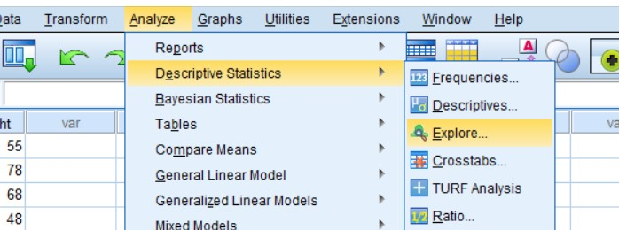
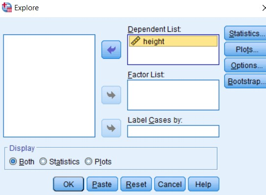
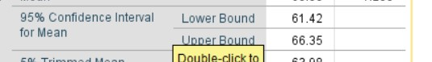

# Confidence interval of mean assuming normal distribution

## Steps

_for example of data set:_ 
__height :__ 
78, 55, 68, 48, 65, 76, 57, 55, 65, 75, 51, 61, 68, 67, 76,
78, 71, 56, 57, 67, 58, 51, 50, 58, 50, 77, 55, 48, 70, 55, 58,
70, 56, 52, 74, 61, 69, 76, 61, 68, 78, 56, 78, 57, 66, 66, 74,
66, 48, 73, 71, 70, 62, 74, 76, 50, 69, 75, 65, 48

- In the variable view, add the required variable name with specific details.

  

- Goto data view and add the given data.

- Click on __Analyze__ tab, __Descriptive Statistics__ and __Explore__.

  

- Add the required variable in __Dependent List__ and click __Paste__ or __OK__.

  

- Required Output(Confidence Interval of Mean):

  
