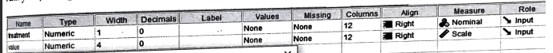
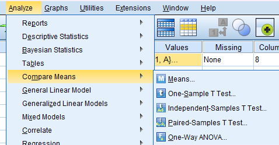
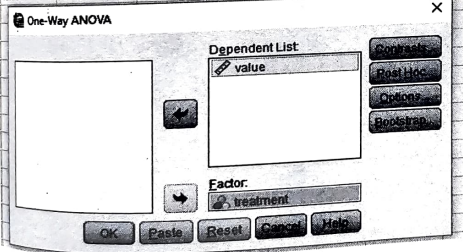
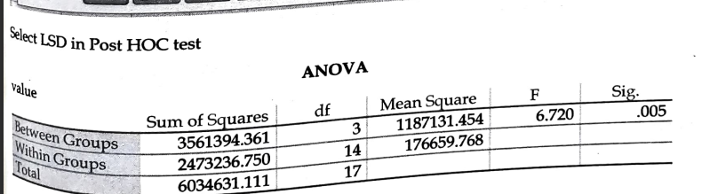

# CRD (Completely Randomized Design)

## Steps

_for example of data set:_

The yield of treatments in different plots are shown in the following plots. Carry out the analysis.

- Goto variable view and add the variables

  

- Goto the data view and add the data

- Click on **Analyze** tab > **Compare Means** > **One Way ANOVA**.

  

- Add the required variable in **Test Variable List** and click **Options**.

  

- Required Output:

  
