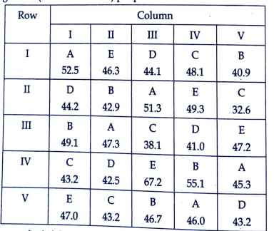
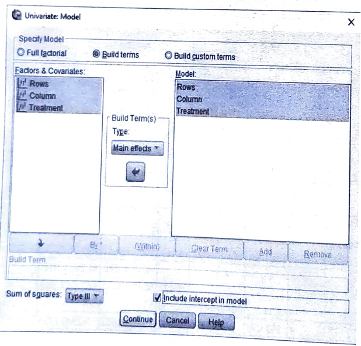
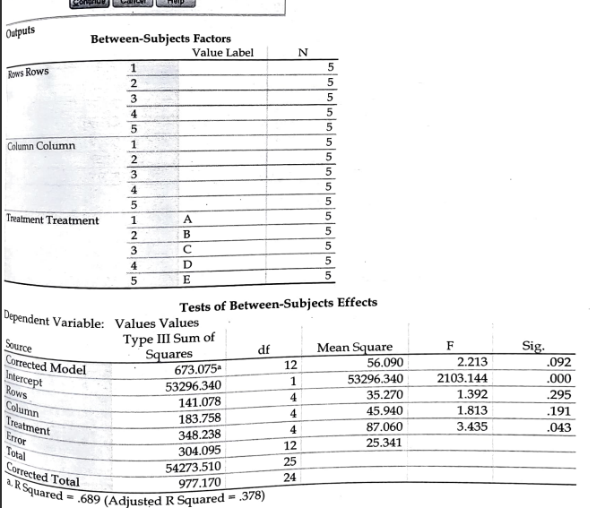
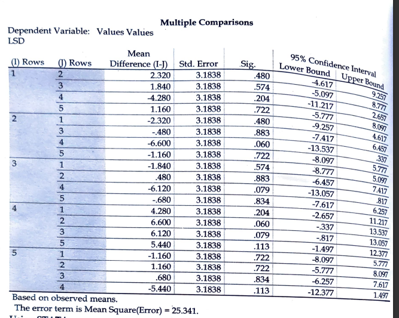

# RBD (Randomized Block Design)

## Steps

_for example of data set:_

Plan and yield of sugarcane (in a suitable unit) per plot

Analyze the above data to find if there are any treatment effects.

- Goto variable view and add the variables

- Goto the data view and add the data

  

- Click on **Analyze** tab > **General linear model** > **Univariate**.

  

- Dialog

  

- Click **Model**.

  

- CLick POST HOC

  

- Required Output:

  

  
