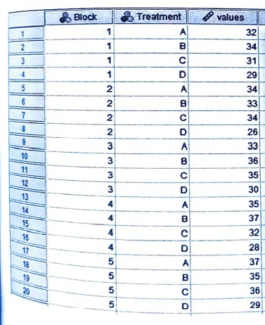
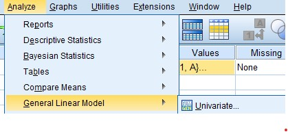
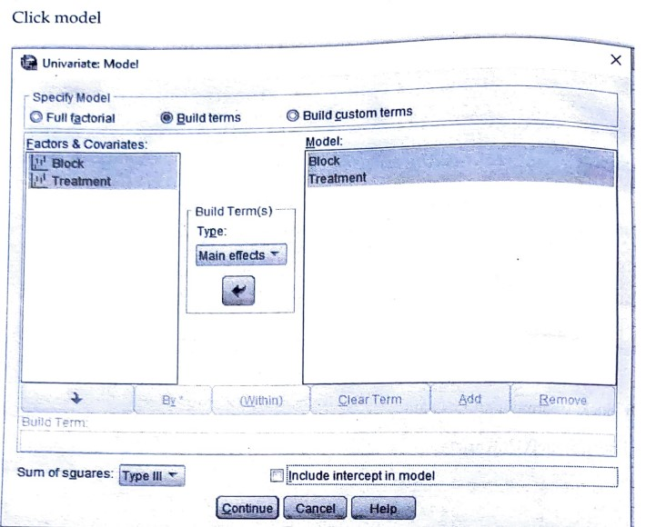
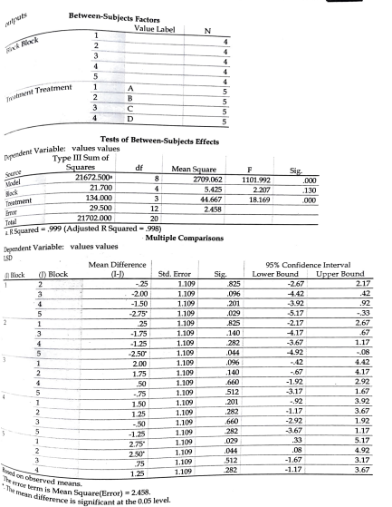

# RBD (Randomized Block Design)

## Steps

_for example of data set:_

The following table gives the result of the experiment on four varieties of a crop in 5 blocks of plot.

Analyze the above result to test whether there is significant difference between yields of four varities.

- Goto variable view and add the variables

- Goto the data view and add the data

  

- Click on **Analyze** tab > **General linear model** > **Univariate**.

  

- Click **Model**.

  

- CLick POST HOC

  

- Required Output:

  
