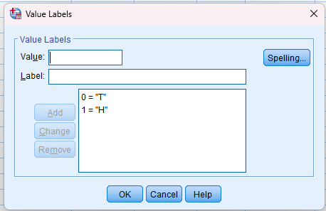
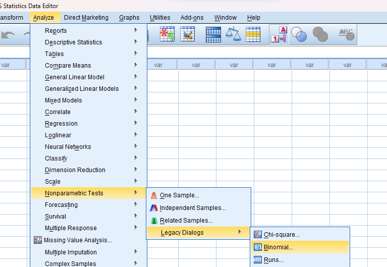
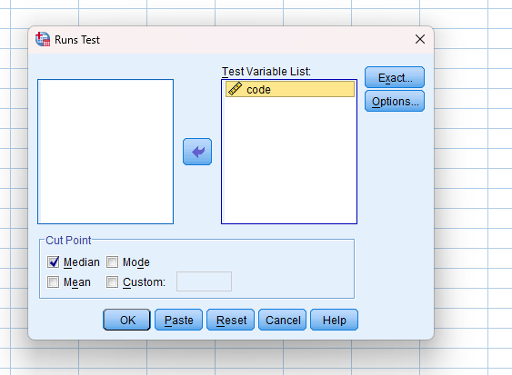

# Binomial Test

## Steps

_for example of data set:_

In 30 toss of a coin, the following sequence of heads(H) and tails(T) was observed.

H T T H T H H H T H H T T H T H T H H T H T T H T H H T H T

Test whether the coin is unbiased from the given sequence.

- Goto variable view and add the variables

  

  - in label

    

- Goto the data view and add the data

  

- Click on **Analyze** tab > **NonParametric Tests** > **Legacy Dialogs** > **Binomial**.

  

- Add the required variable in **Test Variable List** and click **Options**.

  

- Tick the **Descriptives** and **Quartiles** and click **Continue**.

  

- Required Output:

  
