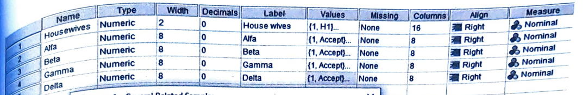
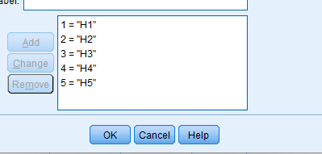
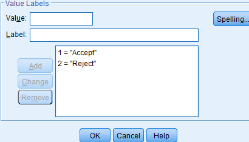
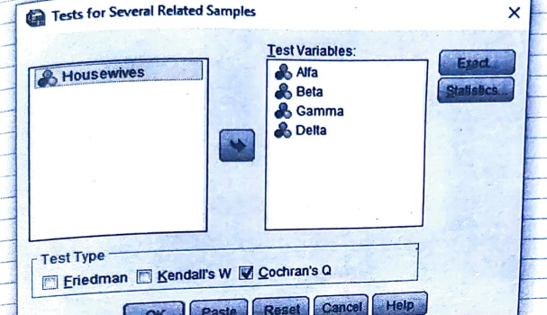
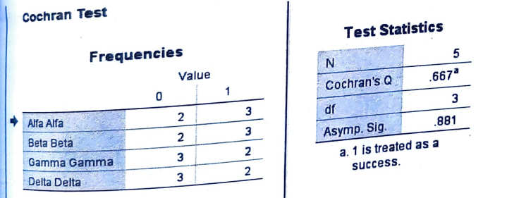

# Cochran Q test

## Steps

_for example of data set:_

Five housewives were asked for the acceptability of four brands of lipsticks for daily use. The response of acceptability (A) and rejection (R) are given below:

<table>
    <thead>
        <tr>
            <th rowspan="2">House Wives</th>
            <th colspan="4">Lipstick Brands</th>
        </tr>
        <tr>
            <th>Alfa</th>
            <th>Beta</th>
            <th>Gamma</th>
            <th>Delta</th>
        </tr>
    </thead>
    <tbody>
        <tr>
            <th>H1</th>
            <th>A</th>
            <th>R</th>
            <th>A</th>
            <th>R</th>
        </tr>
        <tr>
            <th>H2</th>
            <th>R</th>
            <th>A</th>
            <th>A</th>
            <th>R</th>
        </tr>
        <tr>
            <th>H3</th>
            <th>R</th>
            <th>A</th>
            <th>R</th>
            <th>A</th>
        </tr>
        <tr>
            <th>H4</th>
            <th>A</th>
            <th>R</th>
            <th>R</th>
            <th>R</th>
        </tr>
        <tr>
            <th>H5</th>
            <th>A</th>
            <th>A</th>
            <th>R</th>
            <th>A</th>
        </tr>
    </tbody>
</table>

Test whether there is any significant difference between brands with respect to acceptability.

- Goto variable view and add the variables

  

  - in label for Housewives

    

  - in label for Lipstick Brands

    

- Goto the data view and add the data

- Click on **Analyze** tab > **NonParametric Tests** > **Legacy Dialogs** > **k Independent Samples**.

  

- Add the required variable in **Test Variable List** and click **Cochran's Q** and click **OK**.

  

- Required Output:

  
