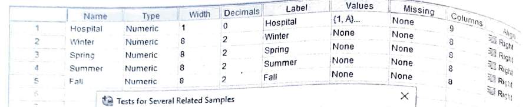
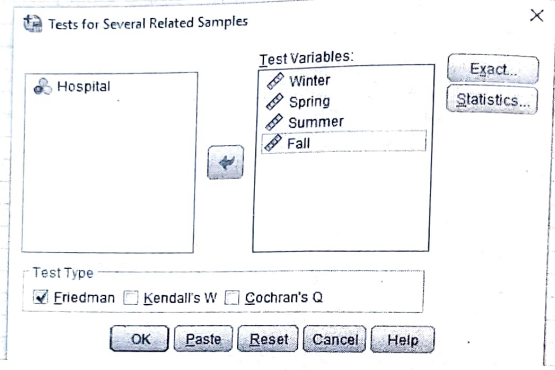
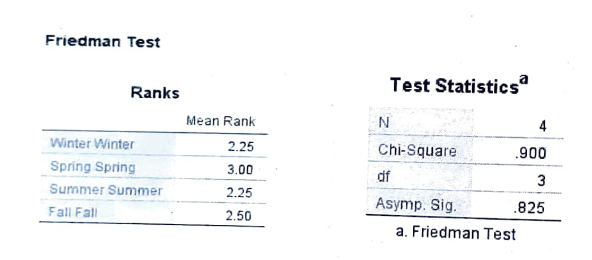

# Friedman F test

## Non-repeated ranks

## Steps

_for example of data set:_

A survey was conducted in four hospitals in a particular city to obtain the number of babies born over a 12 months' period. This time period was divided into four seasons to test the hypothesis that the birth rate is constant over all the four seasons. The results of the survey were as follows:

<table>
    <thead>
        <tr>
            <th rowspan="2">Hospital</th>
            <th colspan="4">No. of births</th>
        </tr>
        <tr>
            <td>Winter</td>
            <td>Spring</td>
            <td>Summer</td>
            <td>Fall</td>
    </thead>
    <tbody>
        <tr>
            <td>A</td>
            <td>92</td>
            <td>72</td>
            <td>94</td>
            <td>77</td>
        </tr>
        <tr>
            <td>B</td>
            <td>15</td>
            <td>16</td>
            <td>10</td>
            <td>17</td>
        </tr>
        <tr>
            <td>C</td>
            <td>58</td>
            <td>71</td>
            <td>51</td>
            <td>62</td>
        </tr>
        <tr>
            <td>D</td>
            <td>19</td>
            <td>26</td>
            <td>20</td>
            <td>18</td>
        </tr>
    </tbody>
</table>

Analyze the data using Friedman two way ANOVA test.

- Goto variable view and add the variables

  

  - in label

    

- Goto the data view and add the data

- Click on **Analyze** tab > **NonParametric Tests** > **Legacy Dialogs** > **k Related Samples**.

  

- Add the required variable in **Test Variable List** and click **OK**.

  

- Required Output:

  
