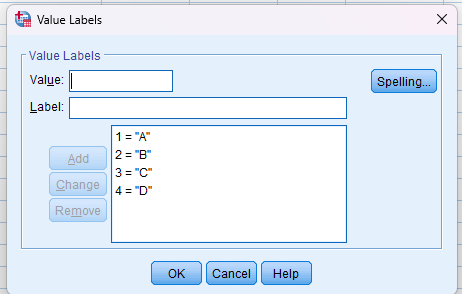
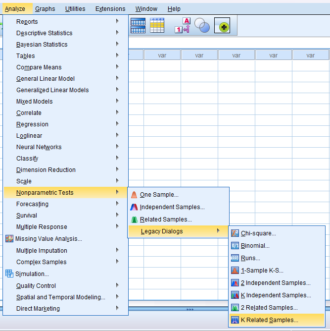
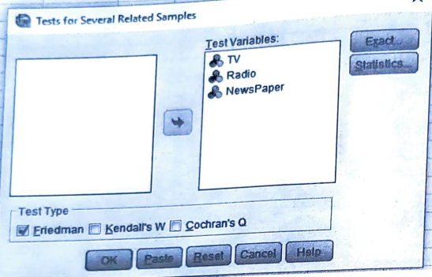
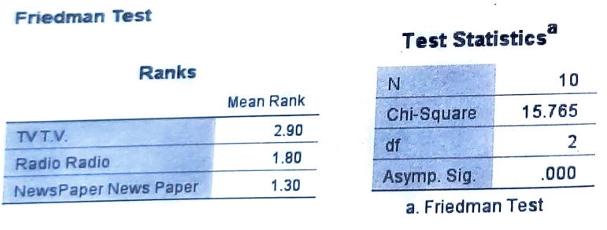

# Friedman F test

## Repeated ranks

## Steps

_for example of data set:_

Three different advertising media T.V., Radio and Newspaper are being compared to study the effectiveness in promoting sales of WaiWai noodles. Each advertising media is exposed for specified period of time and sales (000 package) from 10 stores located at different areas are recorded.

<table>
    <thead>
        <tr>
            <th rowspan="2">Advertising Media</th>
            <th colspan="10">Stores</th>
        </tr>
        <tr>
            <th>A</th>
            <th>B</th>
            <th>C</th>
            <th>D</th>
            <th>E</th>
            <th>F</th>
            <th>G</th>
            <th>H</th>
            <th>I</th>
            <th>J</th>
        </tr>
        <tr>
            <th>T.V.</th>
            <th>20</th>
            <th>21</th>
            <th>15</th>
            <th>12</th>
            <th>14</th>
            <th>17</th>
            <th>21</th>
            <th>16</th>
            <th>20</th>
            <th>18</th>
        </tr>
        <tr>
            <th>Radio</th>
            <th>7</th>
            <th>9</th>
            <th>11</th>
            <th>12</th>
            <th>10</th>
            <th>10</th>
            <th>14</th>
            <th>12</th>
            <th>8</th>
            <th>7</th>
        </tr>
        <tr>
            <th>NewsPaper</th>
            <th>8</th>
            <th>6</th>
            <th>11</th>
            <th>12</th>
            <th>9</th>
            <th>6</th>
            <th>8</th>
            <th>10</th>
            <th>8</th>
            <th>6</th>
        </tr>
    </thead>
</table>

Are three advertising media equally effective in promoting sales of WaiWai noodles? Use Friedman two-way ANOVA test.

- Goto variable view and add the variables

  

  - in label

    

- Goto the data view and add the data

- Click on **Analyze** tab > **NonParametric Tests** > **Legacy Dialogs** > **k Related Samples**.

  

- Add the required variable in **Test Variable List** and click **OK**.

  

- Required Output:

  
