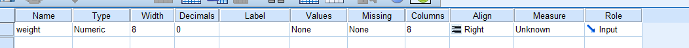
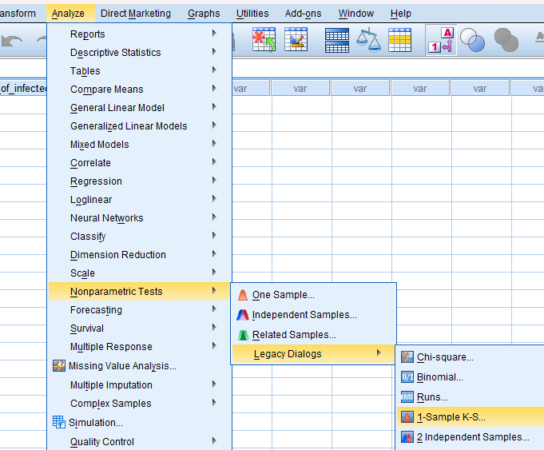
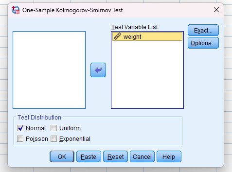
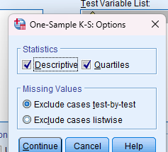
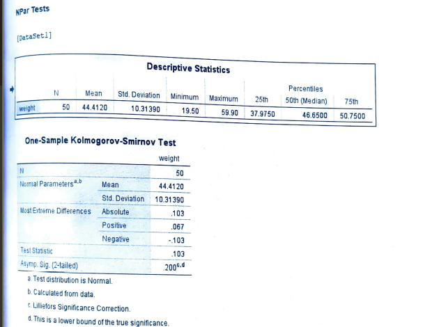

# Kolmogorov-Smirnov one sample test

- Test for normal distribution

## Steps

_for example of data set:_

weight:

19.5 20 26.9 27.1 28.1 30 31.6 32.7 34.4 37.2

37.5 37.9 38 38.4 38.6 38.8 38.9 40.1 41.6 42.6

42.9 45 45.2 45.5 46.5 46.8 47.3 48.1 48.3 48.4

48.8 49 49.1 49.3 49.4 49.5 49.9 50.4 51.8 54.4

54.9 55.3 55.6 57.3 57.4 57.5 58.7 58.8 59.7 59.9

- Goto variable view and add the variables

  

- Goto the data view and add the data

- Click on **Analyze** tab > **NonParametric Tests** > **Legacy Dialogs** > **1-Sample K-S**.

  

- Add the required variable in **Test Variable List** and click **Options**.

  

- Tick the **Descriptives** and **Quartiles** and click **Continue**.

  

- Required Output:

  
