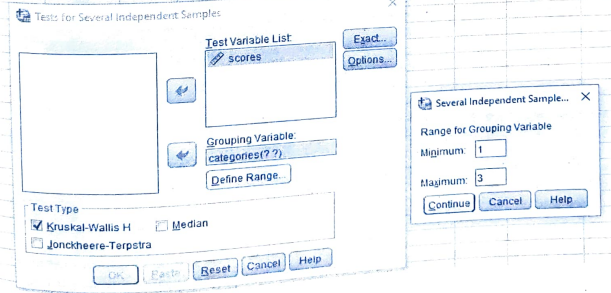
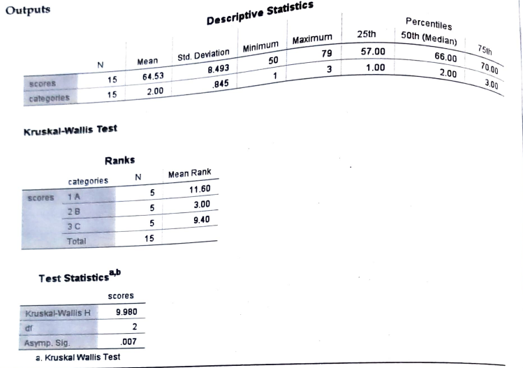

# Kruskal Wallis H test

## Non-repeated ranks

## Steps

_for example of data set:_

Following are the scores obtained by trainees in 3 different training programs. Test whether 3 categories have performed equally.

<table>
    <thead>
        <tr>
            <th>Categories</th>
            <th colspan="10">Scores</th>
        </tr>
    </thead>
    <tbody>
        <tr>
            <td>A</td>
            <td>68</td>
            <td>65</td>
            <td>92</td>
            <td>82</td>
            <td>62</td>
            <td>64</td>
            <td>68</td>
            <td>92</td>
            <td>86</td>
            <td>64</td>
        <tr>
            <td>B</td>
            <td>93</td>
            <td>86</td>
            <td>73</td>
            <td>87</td>
            <td>76</td>
            <td>85</td>
            <td>67</td>
            <td>79</td>
            <td>75</td>
            <td>75</td>
        </tr>
        <tr>
            <td>C</td>
            <td>95</td>
            <td>72</td>
            <td>85</td>
            <td>70</td>
            <td>80</td>
            <td>80</td>
            <td>78</td>
            <td>85</td>
            <td>72</td>
            <td>90</td>
        </tr>
    </tbody>
</table>

- Goto variable view and add the variables

  

  - in label

    

- Goto the data view and add the data

- Click on **Analyze** tab > **NonParametric Tests** > **Legacy Dialogs** > **k Independent Samples**.

  

- Add the required variable in **Test Variable List** and perform in **Options** and click **OK**.

  

- Required Output:

  
