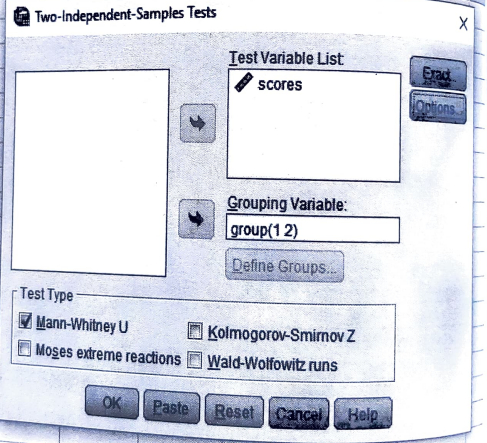
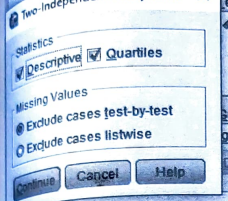
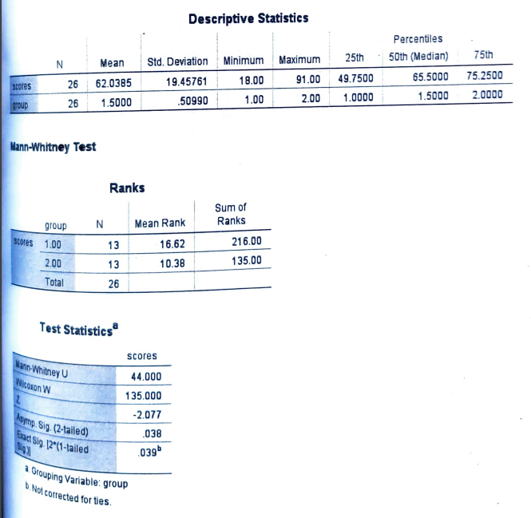

# Mann Whitney U test

## Large sample

## Steps

_for example of data set:_

The following are the scores which random samples of students from 2 minority groups obtained on a current event test:

| Minority Group I  | 73  | 82  | 39  | 68  | 91  | 75  | 89  | 67  | 50  | 86  | 57  | 65  | 70  |
| ----------------- | --- | --- | --- | --- | --- | --- | --- | --- | --- | --- | --- | --- | --- |
| Minority Group II | 51  | 42  | 36  | 53  | 88  | 59  | 49  | 66  | 25  | 64  | 18  | 76  | 74  |

Use the Mann-Whitney U test at the 0.05 level of significance to test whether the two groups differ significantly in their scores on the test.

- Goto variable view and add the variables

- Goto the data view and add the data

- Click on **Analyze** tab > **NonParametric Tests** > **Legacy Dialogs** > **2 Independent Samples**.

  

- Add the required variable in **Test Variable List** and click **Options**.

  

- Tick **Descriptives** and **Quartiles** and click **Continue**.

  

- Required Output:

  
