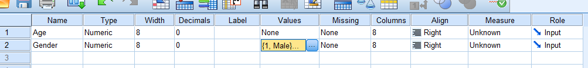
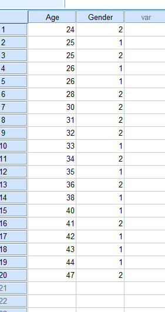
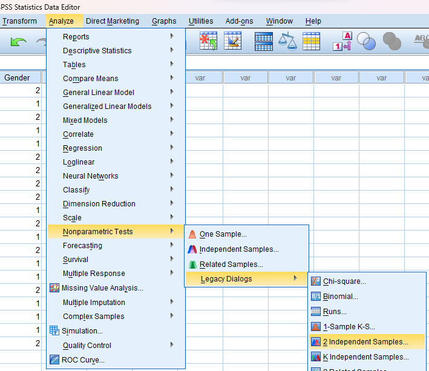
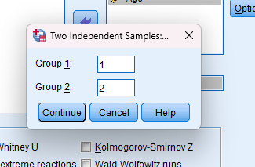

# Mann Whitney U test

## Small sample

## Steps

_for example of data set:_

Test the hypothesis of no difference between the ages of male and female employees of a certain company, using the Mann-Whitney U test for the sample data below. Use alpha = 0.1.

| Male   | 35  | 43  | 26  | 44  | 40  | 42  | 33  | 38  | 25  | 26  |
| ------ | --- | --- | --- | --- | --- | --- | --- | --- | --- | --- |
| Female | 30  | 41  | 34  | 31  | 36  | 32  | 25  | 47  | 28  | 24  |

- Goto variable view and add the variables

  

  - in label

    

- Goto the data view and add the data

  

- Click on **Analyze** tab > **NonParametric Tests** > **Legacy Dialogs** > **2 Independent Samples**.

  

- Add the required variable in **Test Variable List** and click **Options**.

  

- Manage Group1 and Group 2 and click **Continue**.

  

- Required Output:

  
