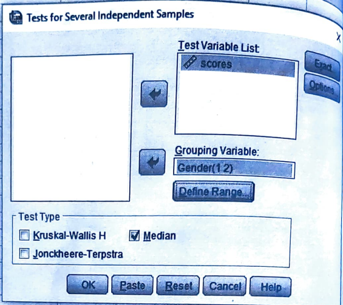
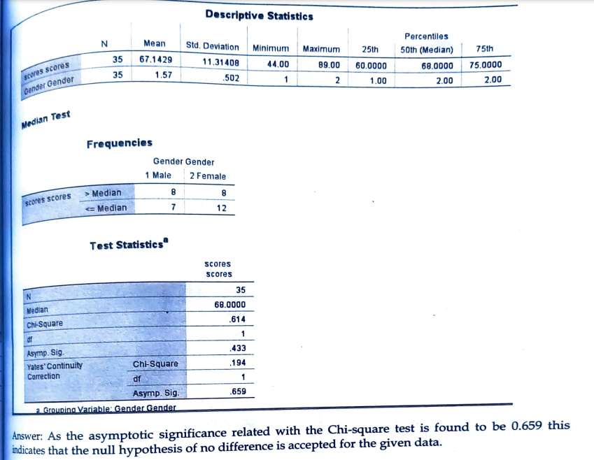

# Median Test

## Large sample (n1 > 10, n2 > 10)

## Steps

_for example of data set:_

An IQ test was given to a randomly selected 15 males and 20 female students of a university. Their scores were recorded as follows:

Male: 56, 66, 62, 81, 75, 73, 83, 68, 48, 70, 60, 77, 86, 44, 72

Female: 63, 77, 65, 71, 74, 60, 76, 61, 67, 72, 64, 65, 55, 89, 45, 53, 68, 73, 50, 81

Use median test at 0.05 level of significance. (Given that median of combined sample=68)

- Goto variable view and add the variables

- Goto the data view and add the data

- Click on **Analyze** tab > **NonParametric Tests** > **Legacy Dialogs** > **k Independent Samples**.

  

- Add the required variable in **Test Variable List** and click **Options**.

  

- Click **Descriptives** and **Quartiles** and click **Continue**.

  

- Required Output:

  
