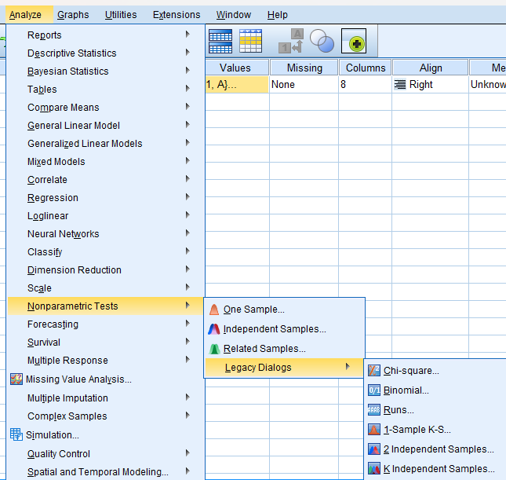
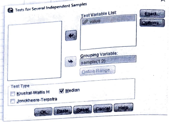
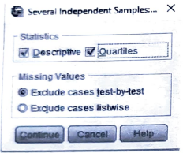
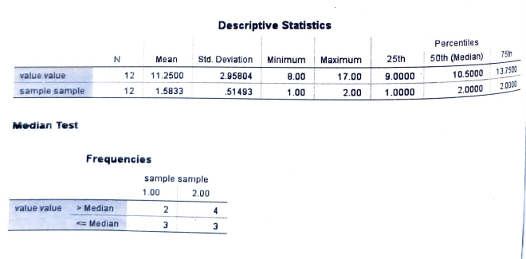

# Median Test

## Small sample (n1 <= 10, n2 <= 10)

## Steps

_for example of data set:_

Data below shows one week growth(in cm) of maize plant from two different localities (Sample I & Sample II):

| Sample I  | 10  | 11  | 8   | 8   | 14  | -   | -   |
| --------- | --- | --- | --- | --- | --- | --- | --- |
| Sample II | 9   | 12  | 13  | 9   | 15  | 9   | 17  |

Test whether the two samples have come from the same population with respect to their medians. Use median test at 0.05 level of significance.

- Goto variable view and add the variables

- Goto the data view and add the data

- Click on **Analyze** tab > **NonParametric Tests** > **Legacy Dialogs** > **k Independent Samples**.

  

- Add the required variable in **Test Variable List** and click **Options**.

  

- Click **Descriptives** and **Quartiles** and click **Continue**.

  

- Required Output:

  

  
