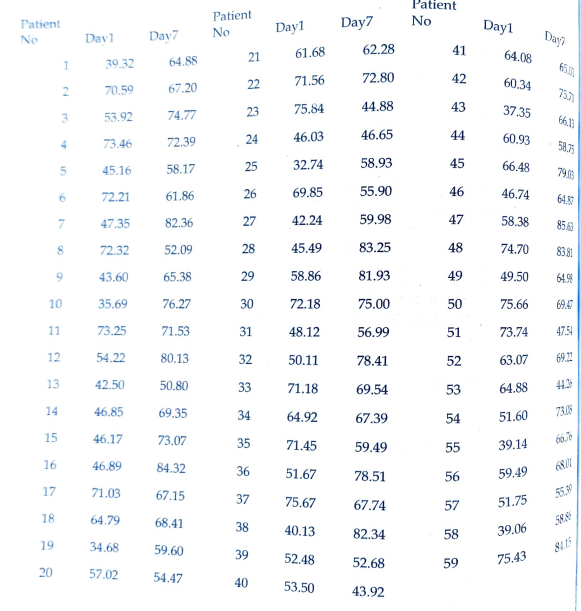
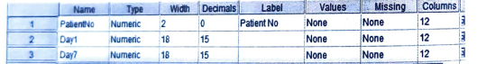
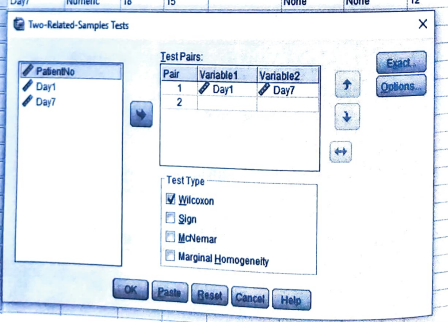
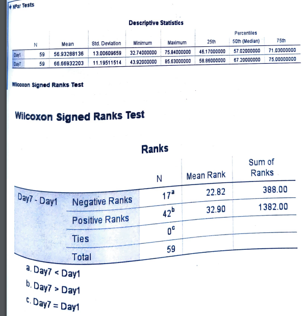

# Wilcoxon Matched pair signed rank test

## Large sample (n > 25)

## Steps

_for example of data set:_

Use Wilcoxon Matched pair signed rank test to determine the equality of oxygen level fo patiens in ICU on the day of admission and 7 days after admission from following data

- Goto variable view and add the variables

  

- Goto the data view and add the data

- Click on **Analyze** tab > **NonParametric Tests** > **Legacy Dialogs** > **2 Related Samples**.

  

- Add the required variable in **Test Variable List** and click **Options**.

  

- Click **Descriptives** and **Quartiles** and click **Continue**.

  

- Required Output:

  

  

**Since, p < 0.05, it is significant.**
