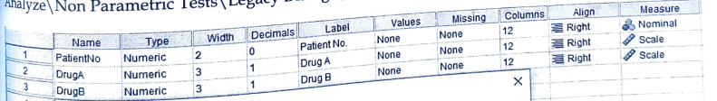
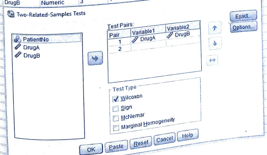
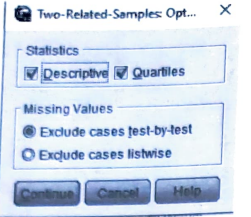
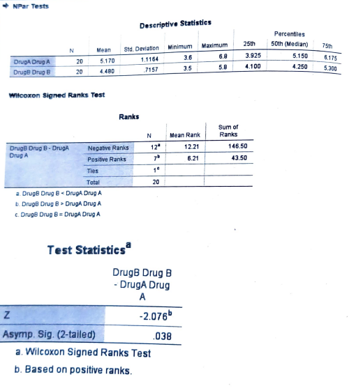

# Wilcoxon Matched pair signed rank test

## Small sample (n < 25)

## Steps

_for example of data set:_

Use Wilcoxon Matched pair signed rank test to determine the equality of effectiveness of two types of drugs in suppressing pair from following data

| Patient No. | Drug A | Drug B |
| ----------- | ------ | ------ |
| 1           | 6.5    | 3.5    |
| 2           | 3.7    | 3.7    |
| 3           | 3.9    | 4.7    |
| 4           | 6.7    | 5.0    |
| 5           | 6.2    | 5.6    |
| 6           | 6.7    | 4.3    |
| 7           | 6.1    | 5.4    |
| 8           | 4.3    | 5.8    |
| 9           | 5.5    | 4.3    |
| 10          | 6.8    | 4.3    |
| 11          | 5.4    | 5.4    |
| 12          | 4.0    | 4.1    |
| 13          | 5.7    | 4.1    |
| 14          | 3.9    | 4.2    |
| 15          | 3.6    | 3.7    |
| 16          | 4.9    | 4.1    |
| 17          | 3.9    | 5.4    |
| 18          | 5.8    | 3.7    |
| 19          | 4.9    | 4.1    |
| 20          | 4.9    | 4.1    |

- Goto variable view and add the variables

  

- Goto the data view and add the data

- Click on **Analyze** tab > **NonParametric Tests** > **Legacy Dialogs** > **2 Related Samples**.

  

- Add the required variable in **Test Variable List** and click **Options**.

  

- Click **Descriptives** and **Quartiles** and click **Continue**.

  

- Required Output:

  

**Since, p < 0.05, it is significant.**
