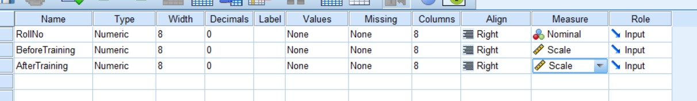
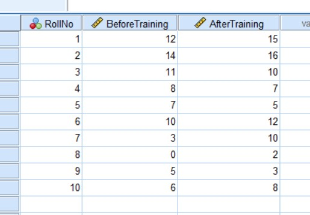
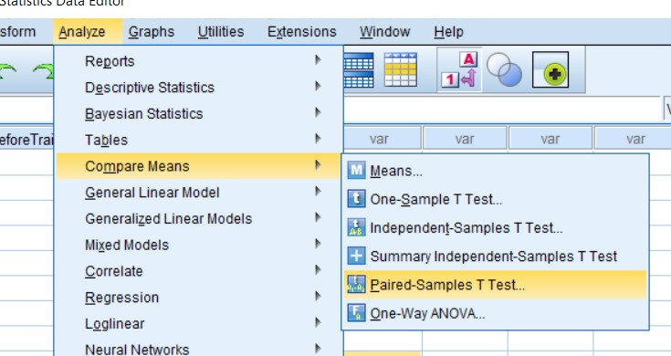
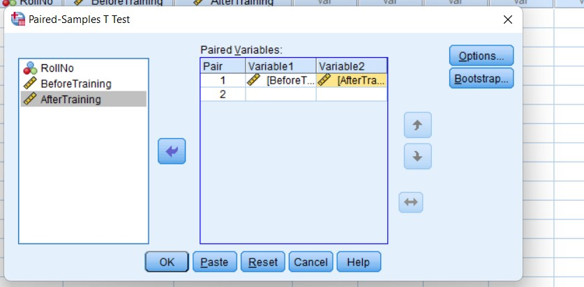
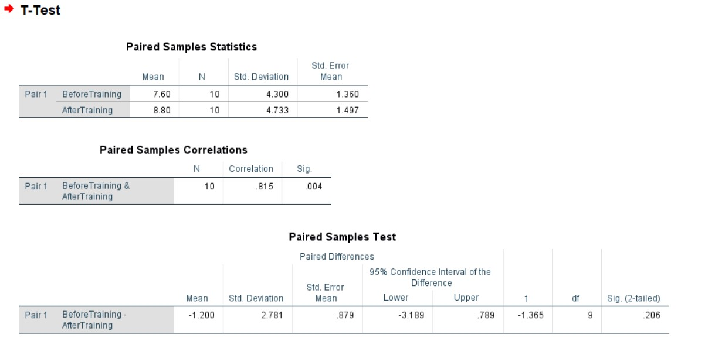

# Two Sample T test

- the number of datasets must be equal

## Steps

_for example of data set:_

Memory capacity of 10 students was tested before and after training, state whether the training was effective of not from the following scores.

| Roll No.        | 1   | 2   | 3   | 4   | 5   | 6   | 7   | 8   | 9   | 10  |
| --------------- | --- | --- | --- | --- | --- | --- | --- | --- | --- | --- |
| Before Training | 12  | 14  | 11  | 8   | 7   | 10  | 3   | 0   | 5   | 6   |
| After Training  | 15  | 16  | 10  | 7   | 5   | 12  | 10  | 2   | 3   | 8   |

- Goto variable view and add the variables

  

- Goto data view and add the given data.

  

- Click on **Analyze** tab > **Compare Means** > **Paired-Samples T test**.

  

- Add the required variable in **Paired Variables** and click **Paste** or **OK**.

  

  - Add before to variable1
  - Add after to variable2

- Required Output:

  
