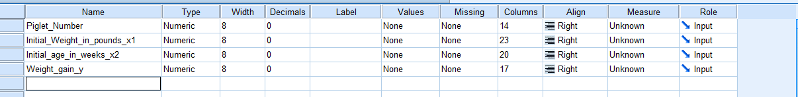
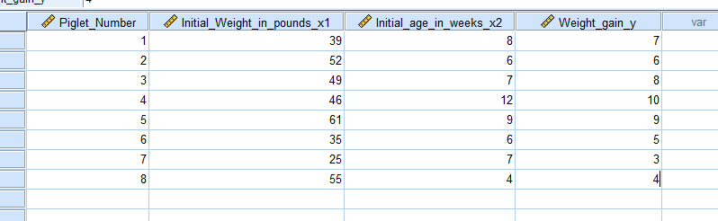
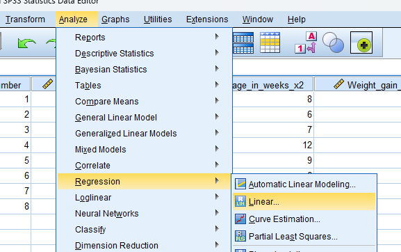
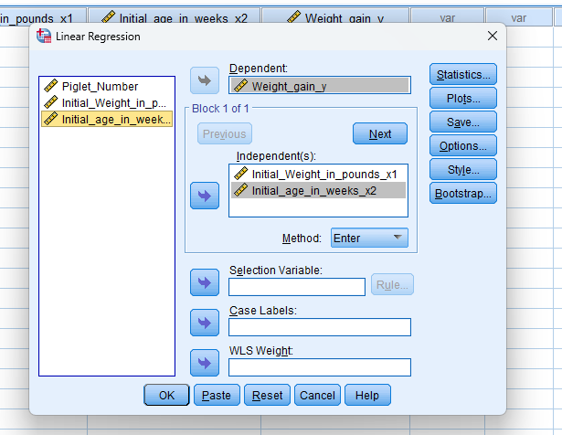
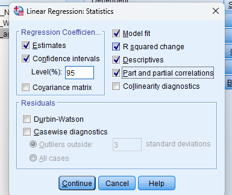
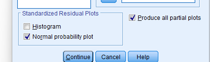
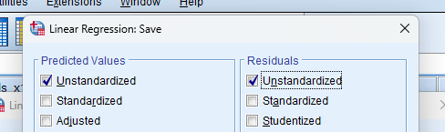

# Regression Analysis

## Steps

_for example of data set:_

Qn) A developer of food for pig wish to determine what relationship exists among 'age of a pig' when it starts receiving a newly developed food supplement, the inital weight of the pig and the amount of weight it gains in a week period with the food supplement. The following information is the result of study of eight piglets.

| Piglet number  | Initial weight (pounds) 
x1
 | Initial age (weeks) 
x2
 | Weight gain 
y
 |
| :----------------- | :--------------------------------------------------------: | :----------------------------------------------------: | :--------------------------------: |
| 1                  |                             39                             |                           8                            |                 7                  |
| 2                  |                             52                             |                           6                            |                 6                  |
| 3                  |                             49                             |                           7                            |                 8                  |
| 4                  |                             46                             |                           12                           |                 10                 |
| 5                  |                             61                             |                           9                            |                 9                  |
| 6                  |                             35                             |                           6                            |                 5                  |
| 7                  |                             25                             |                           7                            |                 3                  |
| 8                  |                             55                             |                           4                            |                 4                  |

1. Determine the least square equation that best describes these three variables.
2. Calculate the standard error.
3. How much gain in weight of a pig in a week can we expect with the food supplement if it were 9 weeks old and weighed 48 pounds?
4. Test the significance of the regression coefficients abd overall fit of the regression equation.
5. Conduct the residual analysis.
6. Determine partial correlations, multiple correlation and coefficient of multiple determination. Interpret.

- Goto variable view and add the variables

  

- Goto data view and add the given data.

  

- Click on **Analyze** tab > **Regression** > **Linear**.

  

- Add the dependent variable in **Dependent** and independent variable in **Independent(s)**. Then click **Statistics**.

  

- Tick **Estimates**, **Confidence Intervals**, **Model fit**, **R squared change**, **Descriptives**, **Part and partial correlations** and then **Continue**.

  

- Click **Produce all partial plots** and **Continue**.

  

- Click **Unstandarized** in both tabs and **Continue**.

  

- Required Output:

  [Output site](https://sthsuyash.github.io/regression-analysis-output/)

  [Output](assets/Output1.spv) to open in SPSS.
