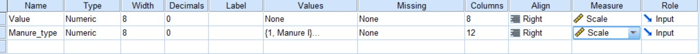
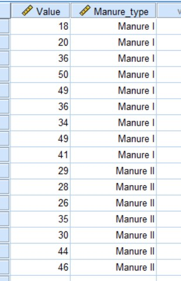

# Two Sample T test

## Steps

_for example of data set:_

| Manure I  | 18  | 20  | 36  | 50  | 49  | 36  | 34  | 49  | 41  |
| --------- | --- | --- | --- | --- | --- | --- | --- | --- | --- |
| Manure II | 29  | 28  | 26  | 35  | 30  | 44  | 46  |

- In the variable view, add the required variable name with specific details.

  

  - in the label section:

      
- Goto data view and add the given data.

  

- Click on **Analyze** tab, **Compare Means** and **Independent-Samples T test**.

  

- Add the required variable in **Dependent List** and click **Paste** or **OK**.

  

- Required Output:

  
