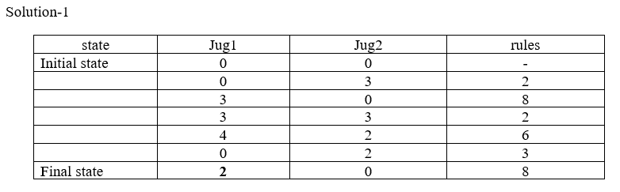
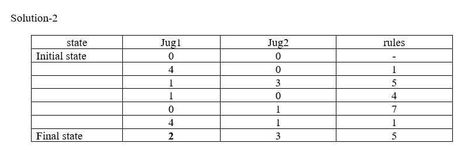
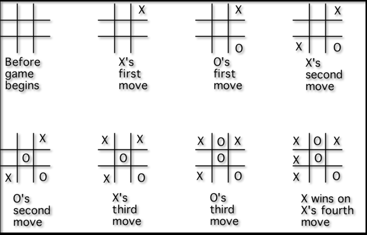
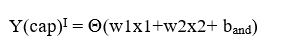
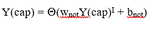
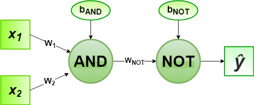

# Artificial Intelligence

## Programs

- [Breadth First Search](bfs.py)
- [Depth First Search](dfs.py)
- [Iterative Deepening Depth First Search](iddfs.py)
- [Greedy Best First Search](greedy_best_first.py)
- [A\* Search](a_star.py)
- [n Queens Problem](nqueen.py)
- [Water Jug Problem](waterjug.py)
- [Tower of Hanoi](tower_of_hanoi.py)
- [Alpha Beta search](alpha_beta_search.py)
- [Hill Climbing](hill_climbing.py)
- [Tic Tac Toe](tic_tac_toe.py)
- [Constraint Satisfaction Problem](csp.py)
- [Perceptron algorithm for NAND logic gate](perceptron.py)

## Theory

- [Breadth First Search](#breadth-first-search)
- [Depth First Search](#depth-first-search)
- [Iterative Deepening Depth First Search](#iterative-deepening-depth-first-search)
- [Greedy Best First Search](#greedy-best-first-search)
- [A\* Search](#a-search)
- [n Queens Problem](#n-queens-problem)
- [Water Jug Problem](#water-jug-problem)
- [Tower of Hanoi](#tower-of-hanoi)
- [Alpha Beta pruning](#alpha-beta-pruning)
- [Hill Climbing](#hill-climbing-algorithm)
- [Tic Tac Toe](#tic-tac-toe)
- [Constraint Satisfaction Problem](#constraint-satisfaction-problem)
- [Perceptron algorithm for NAND logic gate](#nand-using-perceptron)

## [Breadth First Search](bfs.py)

Breadth-first search (BFS) is an algorithm for traversing or searching tree or graph data structures. It starts at the tree root (or some arbitrary node of a graph, sometimes referred to as a 'search key'[1]), and explores all of the neighbor nodes at the present depth prior to moving on to the nodes at the next depth level.

**Algorithm:**

1. Create a queue and enqueue source into it. Mark source as visited.
2. While queue is not empty, do following
   1. Dequeue a vertex from queue. Let this be u.
   2. If u is the destination, then return true.
   3. Else, continue following steps
   4. Enqueue all adjacent vertices of u which are not yet visited.
   5. Mark them visited and continue from step 2.

## [Depth First Search](dfs.py)

Depth-first search (DFS) is an algorithm for traversing or searching tree or graph data structures. The algorithm starts at the root node (selecting some arbitrary node as the root node in the case of a graph) and explores as far as possible along each branch before backtracking.

**Algorithm:**

1. Create a stack and push source into it. Mark source as visited.
2. While stack is not empty, do following
   1. Pop a vertex from stack. Let this be u.
   2. If u is the destination, then return true.
   3. Else, continue following steps
   4. Push all adjacent vertices of u which are not yet visited.
   5. Mark them visited and continue from step 2.

## [Iterative Deepening Depth First Search](iddfs.py)

Iterative deepening depth-first search (IDDFS) is an extension to the 'vanilla' depth-first search algorithm, with an added constraint on the total depth explored per iteration. IDDFS is optimal like breadth-first search, but uses much less memory; at each iteration, it visits the nodes in the search tree in the same order as depth-first search, but the cumulative order in which nodes are first visited is effectively breadth-first.

**Algorithm:**

1. Perform a depth-first search to depth 1, starting from the root.
2. Provided it didn't find the goal, perform a depth-first search to depth 2, starting from the root.
3. Provided it didn't find the goal, perform a depth-first search to depth 3, etc., etc.

## [Greedy Best First Search](greedy_best_first.py)

Greedy best-first search is a best-first search that uses heuristics to improve speed. It expands the most promising node chosen according to the heuristic function. Greedy best-first search algorithm is a search algorithm which is used to solve many problems among them the most common one is the 8-puzzle. It is an informed search algorithm as it uses information about path cost and also uses heuristics to find the solution. It is a best-first search algorithm in which the cost associated with a node is f(n) = h(n). It expands the node that is estimated to be closest to the goal. It is not optimal as it does not guarantee the shortest path. It is complete as it will always find a solution if one exists. It is faster than breadth-first search but slower than A\* search.

**Algorithm:**

1. Create a priority queue and enqueue source into it. Mark source as visited.
2. While queue is not empty, do following
   1. Dequeue a vertex from queue. Let this be u.
   2. If u is the destination, then return true.
   3. Else, continue following steps
   4. Enqueue all adjacent vertices of u which are not yet visited.
   5. Mark them visited and continue from step 2.

## [A\* Search](a_star.py)

A\* is the most popular choice for pathfinding, because it’s fairly flexible and can be used in a wide range of contexts. A\* is like Dijkstra’s Algorithm in that it can be used to find a shortest path. A\* is like Greedy Best-First-Search in that it can use a heuristic to guide itself.

**Algorithm:**

1. Create a priority queue and enqueue source into it. Mark source as visited.
2. While queue is not empty, do following
   1. Dequeue a vertex from queue. Let this be u.
   2. If u is the destination, then return true.
   3. Else, continue following steps
   4. Enqueue all adjacent vertices of u which are not yet visited.
   5. Mark them visited and continue from step 2.

## [n Queens Problem](nqueen.py)

The n-queens puzzle is the problem of placing n queens on an n×n chessboard such that no two queens attack each other. Given an integer n, print all distinct solutions to the n-queens puzzle. Each solution contains distinct board configurations of the n-queens’ placement, where the solutions are a permutation of [1,2,3..n] in increasing order, here the number in the ith place denotes that the ith-column queen is placed in the row with that number. For eg below figure represents a chessboard [3 1 4 2].

**Algorithm:**

1. Start in the leftmost column
2. If all queens are placed
   1. return true
3. Try all rows in the current column. Do following for every tried row.
   1. If the queen can be placed safely in this row then mark this [row, column] as part of the solution and recursively check if placing queen here leads to a solution.
   2. If placing the queen in [row, column] leads to a solution then return true.
   3. If placing queen doesn't lead to a solution then unmark this [row, column](Backtrack) and go to step (a) to try other rows.
4. If all rows have been tried and nothing worked, return false to trigger backtracking.

## [Water Jug Problem](water_jug.py)

1. J1 and j2 are two jugs
2. (x, y) : order pair
3. x: maximum water storage capacity of jug1 is 4 gallons i.e. x=4
4. y: maximum water storage capacity of jug2 is 3 gallons i.e. y=3
5. No mark on jug
6. Pump to fill the water into the jug
7. How can you get exactly 2 gallon of water into the 4-gallons jug?

Solution:

## [Tower of Hanoi](tower_of_hanoi.py)

The Tower of Hanoi is a mathematical game or puzzle. It consists of three rods and a number of disks of different sizes, which can slide onto any rod. The puzzle starts with the disks stacked on one rod in order of decreasing size, the smallest at the top, thus approximating a conical shape. The objective of the puzzle is to move the entire stack to another rod, obeying the following simple rules:

1. Only one disk can be moved at a time.
2. Each move consists of taking the upper disk from one of the stacks and placing it on top of another stack or on an empty rod.
3. No larger disk may be placed on top of a smaller disk.

**Algorithm:**

1. Move top n-1 disks from source to auxiliary tower.
2. Move the nth disk from source to destination tower.
3. Move the n-1 disks from auxiliary tower to destination tower.

## [Alpha Beta Pruning](alpha_beta_pruning.py)

Alpha–beta pruning is a search algorithm that seeks to decrease the number of nodes that are evaluated by the minimax algorithm in its search tree. It is an adversarial search algorithm used commonly for machine playing of two-player games (Tic-tac-toe, Chess, Go, etc.). It stops evaluating a move when at least one possibility has been found that proves the move to be worse than a previously examined move. Such moves need not be evaluated further. When applied to a standard minimax tree, it returns the same move as minimax would, but prunes away branches that cannot possibly influence the final decision.

**Algorithm:**

1. Initialize alpha with -INFINITY and beta with +INFINITY.
2. Maximizer and Minimizer are two players.
3. Maximizer makes a move and calls Minimizer.
4. Minimizer makes a move and calls Maximizer.
5. Repeat the above two steps till any one of the player wins the game or the game ends.
6. At each level, compare the value of alpha and beta.
7. If alpha is greater than or equal to beta, stop further evaluation and return alpha.
8. Else, return beta.

## [Hill climbing algorithm](./hill_climbing.py)

Hill climbing algorithm is a local search algorithm which continuously moves in the direction of increasing elevation/value to find the peak of the mountain or best solution to the problem. It terminates when it reaches a peak value where no neighbor has a higher value. Hill climbing algorithm is a technique which is used for optimizing the mathematical problems. One of the widely discussed examples of Hill climbing algorithm is Traveling-salesman Problem in which we need to minimize the distance traveled by the salesman. It is also called greedy local search as it only looks to its good immediate neighbor state and not beyond that. A node of hill climbing algorithm has two components which are state and value. Hill Climbing is mostly used when a good heuristic is available. In this algorithm, we don't need to maintain and handle the search tree or graph as it only keeps a single current state.

**Algorithm:**

1. Evaluate the initial state, if it is goal state then return success and Stop.
2. Loop Until a solution is found or there is no new operator left to apply.
3. Select and apply an operator to the current state.
4. Check new state:
   1. If it is goal state, then return success and quit.
   2. Else if it is better than the current state then assign new state as a current state.
   3. Else if not better than the current state, then return to step2.
5. Exit.

## [Tic-Tac-Toe](./tic_tac_toe.py)

Tic-tac-toe is a game played by two players on a 3x3 grid. In this game, the first player marks moves with a circle, the second with a cross. The player who has formed a horizontal, vertical, or diag-onal sequence of three marks wins. Your task is to write a program that determines the status of a tic-tac-toe game.

**Algorithm:**

1. Create a 3x3 grid with all values 0.
2. Take input from user for row and column.
3. Check if the position is already filled or not.
4. If not filled, then check if it is player 1 or player 2.
5. If player 1, then fill the position with 1.
6. If player 2, then fill the position with 2.
7. Check if any player has won the game or not.
8. If yes, then print the winner and exit.
9. If no, then continue from step 2.

**Game Rules:**

1. Traditionally the first player plays with "X". So you can decide who wants to go with "X" and who wants go with "O".
2. Only one player can play at a time.
3. If any of the players have filled a square then the other player and the same player cannot override that square.
4. There are only two conditions that may match will be draw or may win.
5. The player that succeeds in placing three respective marks (X or O) in a horizontal, vertical or diagonal row wins the game.

## [Constraint Satisfaction Problem](./csp.py)

Constraint satisfaction problems (CSPs) are mathematical questions defined as a set of objects whose state must satisfy a number of constraints or limitations. CSPs represent the entities in a problem as a homogeneous collection of finite constraints over variables, which is solved by constraint satisfaction methods. CSPs are the subject of intense research in both artificial intelligence and operations research, since the regularity in their formulation provides a common basis to analyze and solve problems of many seemingly unrelated families. CSPs often exhibit high complexity, requiring a combination of heuristics and combinatorial search methods to be solved in a reasonable time. CSPs are applied in many areas including scheduling, planning, vehicle routing, configuration, and the design of communication networks.

**Algorithm:**

1. Initialize all the variables with their domain values.
2. Select a variable and assign it a value from its domain.
3. Check if the assignment is consistent with the constraints.
4. If yes, then select another variable and assign it a value from its domain.
5. If no, then backtrack and select another value from the domain of the previous variable.
6. Repeat steps 3 to 5 until all the variables are assigned with a value from their domain.

## [NAND using Perceptron](./perceptron.py)

A perceptron is a single layer neural network. It is the simplest neural network model. It consists of a single layer of one or more perceptrons (neurons).

In the field of Machine Learning, the Perceptron is a Supervised Learning Algorithm for binary classifiers. The Perceptron Model implements the following function:

For a particular choice of the weight vector x and bias parameter b, the model predicts output y(cap) for the corresponding input vector x.

NAND logical function truth table for 2-bit binary variables, i.e, the input vector x: (x1,x2) and the corresponding output y –

| x1  | x2  | y   |
| --- | --- | --- |
| 0   | 0   | 1   |
| 0   | 1   | 1   |
| 1   | 0   | 1   |
| 1   | 1   | 0   |

We can observe that, NAND(x1,x2) = NOT (AND (x1,x2))
Now for the corresponding weight vector w: (w1,w2) of the input vector x: (x1,x2) to the AND node, the associated Perceptron Function can be defined as:

Later on, the output of AND node Y(cap)I is the input to the NOT node with weight wnot. Then the corresponding output Y(cap) is the final output of the NAND logic function and the associated Perceptron Function can be defined as:

For the implementation, considered weight parameters are w1 = 1, w2 = 1, wnot = -1 and the bias parameters are band=-1.5, bnot = 0.5.

**Algorithm:**

1. Initialize the weights and bias with random values.
2. Take inputs from the user.
3. Calculate the weighted sum of inputs and weights.
4. Pass the weighted sum through the activation function.
5. Calculate the error.
6. Update the weights and bias.
7. Repeat steps 3 to 6 until the error is 0.
