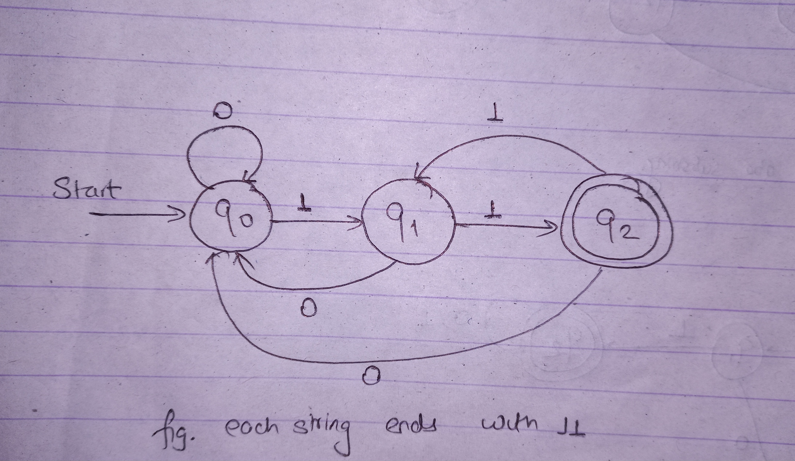
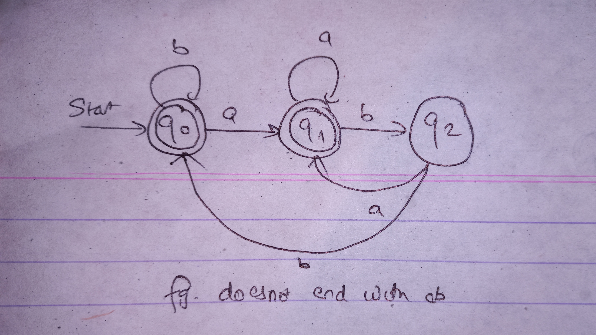
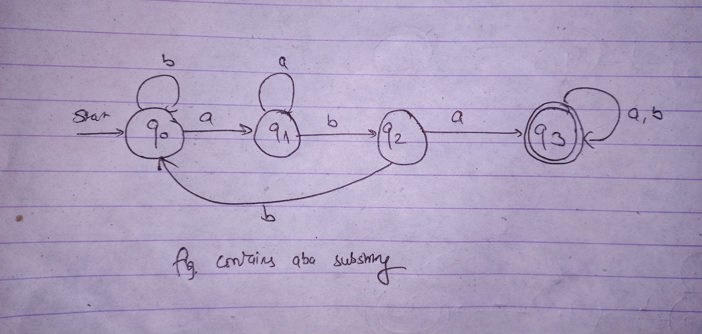
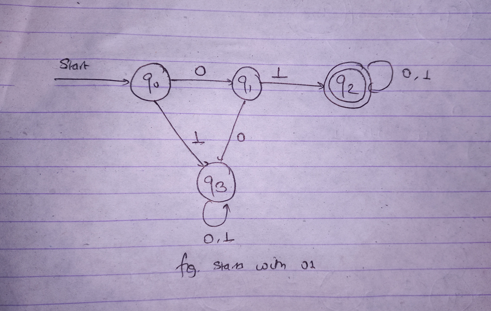
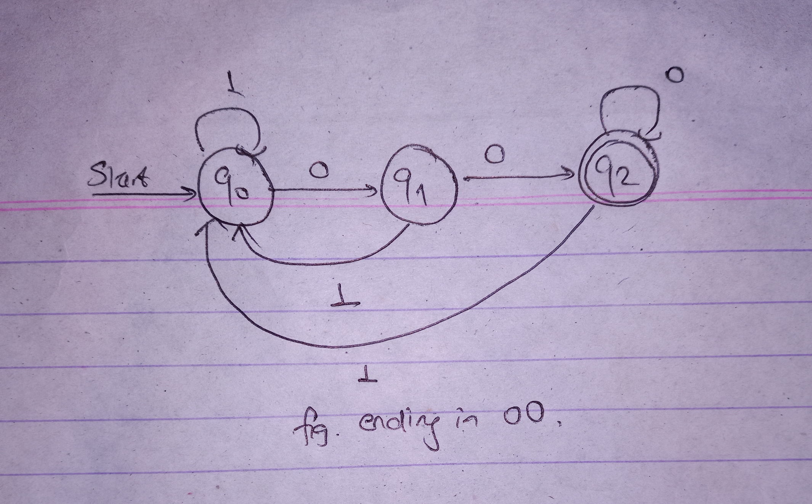
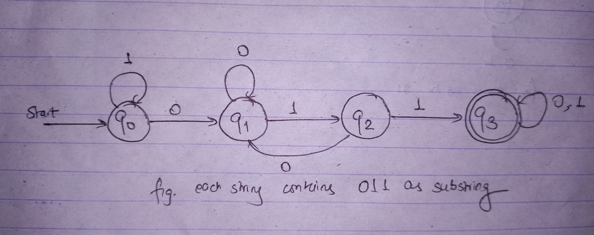

# Lab 1 (DFA)

- [DFA for the language of string over {0.1} in which each string end with 11](string_end_with_11.cpp)
  
- [DFA accepting the string over {a,b} such that each string does not end with ab](string_doesnot_end_with_ab.cpp)
  
- [DFA for the language of string over {a,b} such that each string contain aba as substring](string_contains_aba_substring.cpp)
  
- [DFA for the langague of string over {0,1} such that each string start with 01](string_start_with_01.cpp)
  
- [DFA for the langague of string over {0,1} such that set of all string ending in 00](string_end_with_00.cpp)
  
- [DFA for the langague of string over {0,1} such that set of strings with 011 as a substring](string_contains_011_substring.cpp)
  
