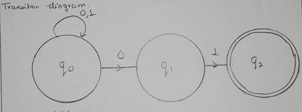
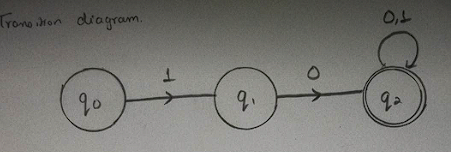
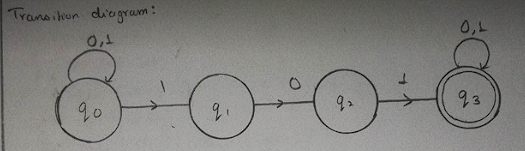

# Lab 2 (NFA)

- [NFA that accepts string ending with 01](string_ending_with_01.cpp) 
  
- [NFA that accepts string starting with 10](string_starting_with_10.cpp) 
  
- [NFA that accepts string containing substring 101](string_containing_substring_101.cpp) 
  
