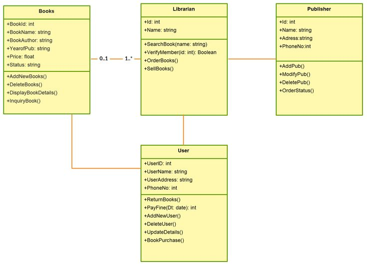
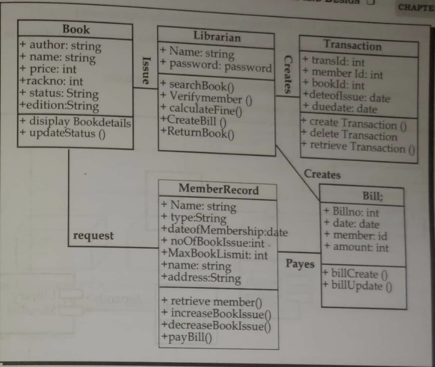
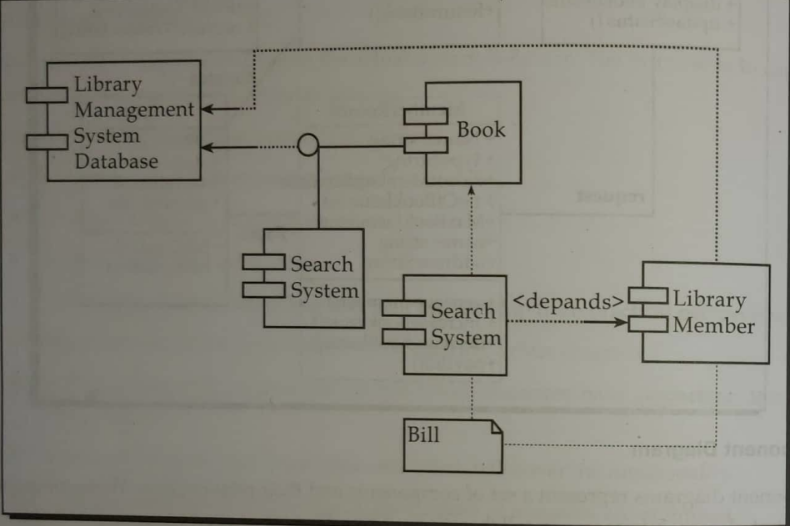
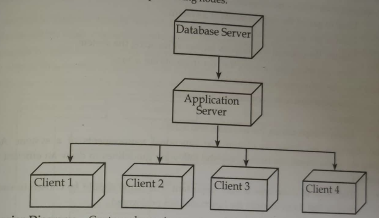
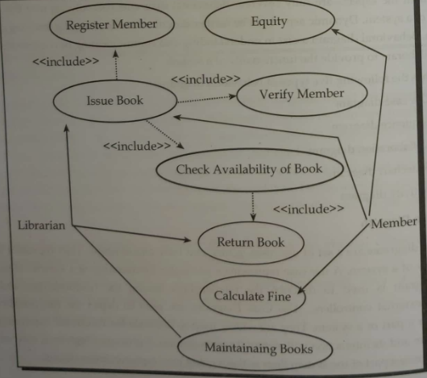
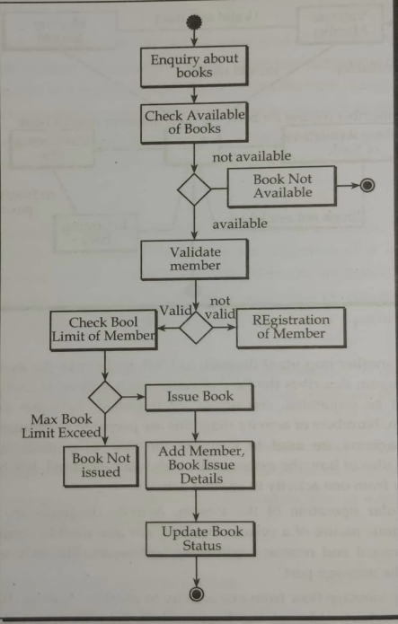
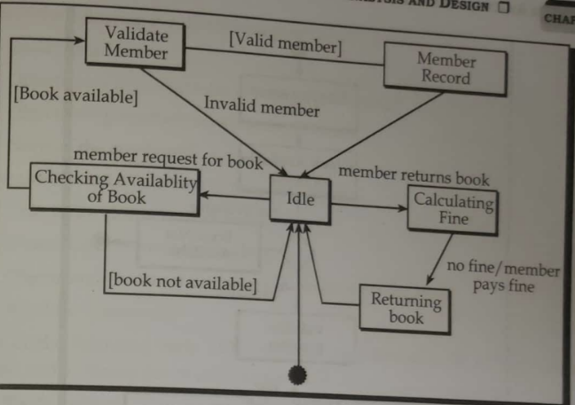
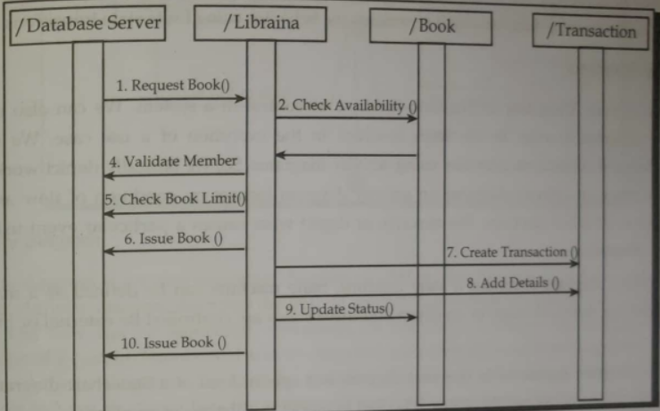

# System Analysis and Design

The SAD practicals contain a report for the software development process of a project, and the UML diagrams for the project.

## Unified Modeling Language (UML)

The Unified Modeling Language (UML) is a standard language for specifying, visualizing, constructing, and documenting the artifacts of software systems, as well as for business modeling and other non-software systems.

The UML diagrams include:

1. [Structure Diagrams](#structure-diagrams)

   - [Class Diagram](#class-diagram)
   - [Object Diagram](#object-diagram)
   - [Component Diagram](#component-diagram)
   - [Deployment Diagram](#deployment-diagram)

2. [Behavior Diagrams](#behavior-diagrams)

   - [Use Case Diagram](#use-case-diagram)
   - [Activity Diagram](#activity-diagram)
   - [State Machine Diagram](#state-machine-diagram)
   - [Sequence Diagram](#sequence-diagram)

**Note:** _The UML diagrams are taken from the KEC publication book._

## Structure Diagrams

The structure diagrams are used to show the static structure of the system. They include the class diagram, object diagram, component diagram, and deployment diagram.

- ### Class Diagram

The class diagram is used to show the classes and their relationships in the system. It is used to show the static structure of the system.

The class diagram for **"Library Management System"** is shown below:

- ### Object Diagram

The object diagram is used to show the objects and their relationships in the system. It is used to show the static structure of the system.

The object diagram for **"Library Management System"** is shown below:

- ### Component Diagram

The component diagram is used to show the components and their relationships in the system. It is used to show the static structure of the system.

The component diagram for **"Library Management System"** is shown below:

- ### Deployment Diagram

The deployment diagram is used to show the deployment of the system. It is used to show the static structure of the system.

It shows the hardware and software components of the system and the relationships between them.

## Behavior Diagrams

The behavior diagrams are used to show the dynamic behavior of the system. They include the use case diagram, activity diagram, state machine diagram, and sequence diagram.

- ### Use Case Diagram

The use case diagram is used to show the use cases of the system. It is used to show the interactions between the system and its users.

The use case diagram for **"Library Management System"** is shown below:

- ### Activity Diagram

The activity diagram is used to show the flow of activities in the system. It is used to show the dynamic structure of the system.

The activity diagram for **"Library Management System"** is shown below:

- ### State Machine Diagram

The state machine diagram is used to show the states of an object and the transitions between the states. It is used to show the dynamic behavior of the system.

The state machine diagram for **"Library Management System"** is shown below:

- ### Sequence Diagram

The sequence diagram is used to show the interactions between the objects in the system. It is used to show the dynamic behavior of the system.

The sequence diagram for **"Library Management System"** is shown below:

